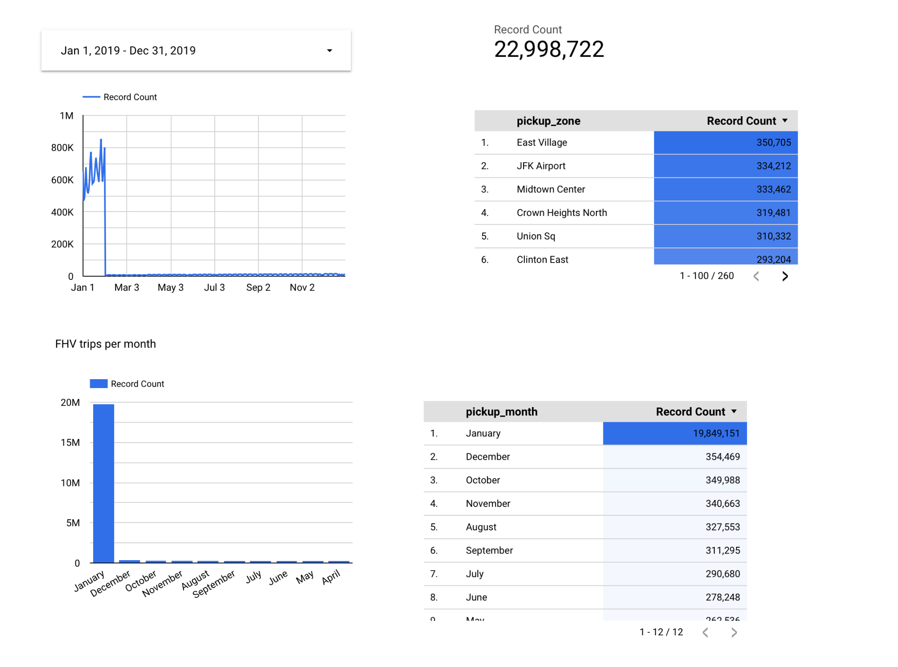

>[Back to Main Homework page](../README.md)
>
>[Back to Week 4 Main page](../../../week_4_analytics_engineering/README.md)
>
> [Homework without solutions](homework.md)

## Week 4 Homework 

In this homework, we'll use the models developed during the week 4 videos and enhance the already presented dbt project using the already loaded Taxi data for fhv vehicles for year 2019 in our DWH.

This means that in this homework we use the following data [Datasets list](https://github.com/DataTalksClub/nyc-tlc-data/)
* Yellow taxi data - Years 2019 and 2020
* Green taxi data - Years 2019 and 2020 
* fhv data - Year 2019. 

We will use the data loaded for:

* Building a source table: `stg_fhv_tripdata`
* Building a fact table: `fact_fhv_trips`
* Create a dashboard 

If you don't have access to GCP, you can do this locally using the ingested data from your Postgres database
instead. If you have access to GCP, you don't need to do it for local Postgres -
only if you want to.

> **Note**: if your answer doesn't match exactly, select the closest option 

### Question 1: 

**What is the count of records in the model fact_trips after running all models with the test run variable disabled and filtering for 2019 and 2020 data only (pickup datetime)?** 

You'll need to have completed the ["Build the first dbt models"](https://www.youtube.com/watch?v=UVI30Vxzd6c) video and have been able to run the models via the CLI. 
You should find the views and models for querying in your DWH.

- 41648442
- 51648442
  - 61648442
- 71648442

### Solution:
  ```
  SELECT count(*) FROM `substantial-mix-378619.production.fact_trips`
  WHERE DATE(pickup_datetime) BETWEEN '2019-01-01' AND '2020-12-31';  
  
  or
  
  SELECT count(*) FROM `substantial-mix-378619.production.fact_trips`
  WHERE extract(year from pickup_datetime) IN (2019, 2020);
  ```
### Result:
  61602988

### Question 2: 

**What is the distribution between service type filtering by years 2019 and 2020 data as done in the videos?**

You will need to complete "Visualising the data" videos, either using [google data studio](https://www.youtube.com/watch?v=39nLTs74A3E) or [metabase](https://www.youtube.com/watch?v=BnLkrA7a6gM). 

*  - 89.9/10.1
- 94/6
- 76.3/23.7
- 99.1/0.9

### Result:
- 89.8/10.2


### Question 3: 

**What is the count of records in the model stg_fhv_tripdata after running all models with the test run variable disabled (:false)?**  

Create a staging model for the fhv data for 2019 and do not add a deduplication step. Run it via the CLI without limits (is_test_run: false).
Filter records with pickup time in year 2019.

- 33244696
  - 43244696
- 53244696
- 63244696

### Solution:
- In folder `models/staging` create file `stg_fhv_tripdata.sql`:
  ```sql
  {{ config(materialized='view') }}
  
  select
      -- base info
      dispatching_base_num,
      Affiliated_base_number as affiliated_base_number,
  
      -- identifiers
      cast(PUlocationID as integer) as  pickup_locationid,
      cast(DOlocationID as integer) as dropoff_locationid,
      cast(SR_Flag as integer) as sr_flag,
  
      -- timestamps
      cast(pickup_datetime as timestamp) as pickup_datetime,
      cast(dropOff_datetime as timestamp) as dropoff_datetime
  
  from {{ source('staging', 'fhv_tripdata') }}
  -- dbt build --m <model.sql> --var 'is_test_run: false'
  
  
    limit 100
  
  
  ```
- In file `models/staging/schema.yml` add (for tests and docs): 
  ```
      - name: stg_fhv_tripdata
        description: >
          This data dictionary describes FHV trip data. Each row represents a single trip in an FHV.
        columns:
            - name: dispatching_base_num
              description: The TLC Base License Number of the base that dispatched the trip
            - name: affiliated_base_number
              description: The TLC Base License Number of the base that dispatched the trip
            - name: pickup_datetime 
              description: The date and time of the trip pick-up
            - name: dropoff_datetime 
              description: The date and time of the trip dropoff
            - name: pickup_locationid
              description: TLC Taxi Zone in which the trip began
              tests:
                - relationships:
                    to: ref('taxi_zone_lookup')
                    field: locationid
                    severity: warn
            - name: dropoff_locationid 
              description: TLC Taxi Zone in which the trip ended
              tests:
                - relationships:
                    to: ref('taxi_zone_lookup')
                    field: locationid
                    severity: warn
            - name: sr_flag 
              description: > 
                Indicates if the trip was a part of a shared ride chain offered
                by a High Volume FHV company (e.g. Uber Pool, Lyft Line). 
                For shared trips, the value is 1. 
                For non-shared rides, this field is null.
  ```
- Run model:
  ```
  dbt run --select stg_fhv_tripdata --var 'is_test_run: false'
  ```
- SQL query to get result:
  ```
  SELECT COUNT(*) FROM `substantial-mix-378619.development.stg_fhv_tripdata`
  WHERE DATE(pickup_datetime) BETWEEN '2019-01-01' AND '2019-12-31';
  
  OR
  
  SELECT COUNT(*) FROM `substantial-mix-378619.production.stg_fhv_tripdata`
  WHERE extract(year from pickup_datetime) IN (2019);
  ```
### Result:
  43244696

### Question 4: 

**What is the count of records in the model fact_fhv_trips after running all dependencies with the test run variable disabled (:false)?**  

Create a core model for the stg_fhv_tripdata joining with dim_zones.
Similar to what we've done in fact_trips, keep only records with known pickup and dropoff locations entries for pickup and dropoff locations. 
Run it via the CLI without limits (is_test_run: false) and filter records with pickup time in year 2019.

- 12998722
  - 22998722
- 32998722
- 42998722

### Solution:
- In folder `models/core` create file `fact_fhv_trips.sql`:
  ```sql
  {{ config(materialized='table') }}
  
  with fhv_trips as (
      select *
      from {{ ref('stg_fhv_tripdata') }}
  ), 
  
  dim_zones as (
      select * from {{ ref('dim_zones') }}
      where borough != 'Unknown'
  )
  
  select 
      fhv_trips.dispatching_base_num, 
      fhv_trips.affiliated_base_number, 
      fhv_trips.sr_flag,
      fhv_trips.pickup_locationid, 
      pickup_zone.borough as pickup_borough, 
      pickup_zone.zone as pickup_zone, 
      fhv_trips.dropoff_locationid,
      dropoff_zone.borough as dropoff_borough, 
      dropoff_zone.zone as dropoff_zone,  
      fhv_trips.pickup_datetime, 
      fhv_trips.dropoff_datetime
  from fhv_trips
  inner join dim_zones as pickup_zone
  on fhv_trips.pickup_locationid = pickup_zone.locationid
  inner join dim_zones as dropoff_zone
  on fhv_trips.dropoff_locationid = dropoff_zone.locationid
  ```
- Run model
  ```
  dbt run --select fact_fhv_trips --var 'is_test_run: false'
  ```
- SQL query to get result:
  ```
  SELECT COUNT(*) FROM `substantial-mix-378619.production.fact_fhv_trips`
  WHERE extract(year from pickup_datetime) IN (2019);
  ```
- Change in Deploy job command from `dbt run` to `dbt run --var 'is_test_run: false'`
- Run Deploy Job
### Result:
  22998722 


### Question 5: 

**What is the month with the biggest amount of rides after building a tile for the fact_fhv_trips table?**

Create a dashboard with some tiles that you find interesting to explore the data. One tile should show the amount of trips per month, as done in the videos for fact_trips, based on the fact_fhv_trips table.

- March
- April
  - January
- December

### Solution:


### Result:
- January

## Submitting the solutions

* Form for submitting: https://forms.gle/6A94GPutZJTuT5Y16
* You can submit your homework multiple times. In this case, only the last submission will be used. 

Deadline: 25 February (Saturday), 22:00 CET


## Solution

* Video: https://www.youtube.com/watch?v=I_K0lNu9WQw&list=PL3MmuxUbc_hJjEePXIdE-LVUx_1ZZjYGW
* Answers:
  * Question 1: 61648442,
  * Question 2: 89.9/10.1
  * Question 3: 43244696
  * Question 4: 22998722
  * Question 5: January

_[Back to the top](#week-4-homework)_