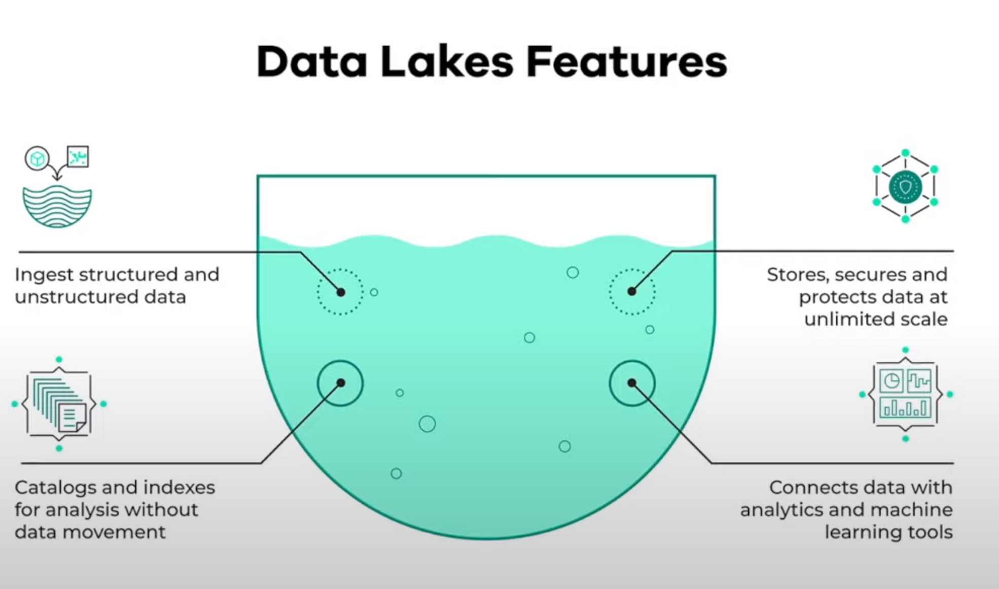
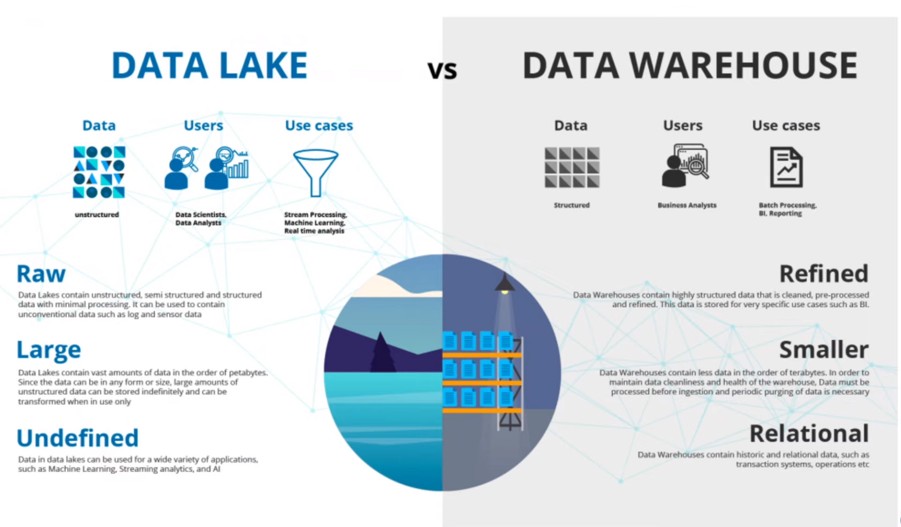

>[Back to Week Menu](README.md)
>
>Next Theme: [Introduction to Workflow orchestration](workflow_orchestration.md)

## Data Lake

_[Slides](https://docs.google.com/presentation/d/1RkH-YhBz2apIjYZAxUz2Uks4Pt51-fVWVN9CcH9ckyY/edit?usp=sharing)_

_:movie_camera: [Video](https://www.youtube.com/watch?v=W3Zm6rjOq70&list=PL3MmuxUbc_hJed7dXYoJw8DoCuVHhGEQb)_

- Ingest data as quick as possible
- Make it available to anyone who wants data
- Associate metadata for faster access
- secure, scalable, fast and cheap

### Data Lake vs Data Warehouse

- Data Lake facilitate fast storing and fast access
- Storing the data fast is the priority of Data Lake; We may not need data now, but we might later.

### How did it start?

- Companies realized the value of data
- Store and access data quickly
- Cannot always define structure of data
- Usefulness of data being realized later in the project lifecycle
- Increase in data scientists
- R&D on data products
- Need for Cheap storage of Big data

### ETL vs ELT

- Extract Transform Load **vs** Extract Load Transform
- Data Warehouse **vs** Data Lake
- Schema on Write **vs** Schema on Read

### Gotcha of Data Lake

- Converting into Data Swamp
- No versioning
- Incompatible schemas for same data without versioning
- No metadata associated
- Joins not possible

### Cloud provider for data lake

- Google Cloud Platform > Cloud Storage
- Amazon Web Services > Amazon S3
- Microsoft Azure > Azure BLOB Storage

_[Back to the top](#data-lake)_