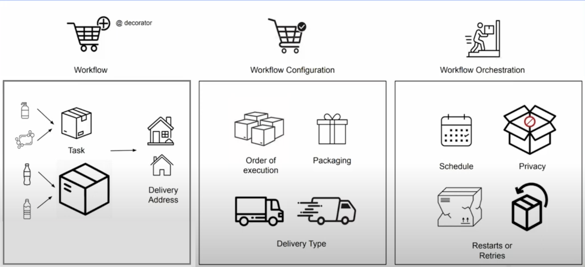

>[Back to Week Menu](README.md)
>
>Previous Theme: [Data Lake (GCS)](data_lake.md)
>
>Next Theme: [Introduction to Prefect concepts](prefect_concepts.md)

## Introduction to Workflow orchestration
_:movie_camera: [Video](https://www.youtube.com/watch?v=8oLs6pzHp68&list=PL3MmuxUbc_hJed7dXYoJw8DoCuVHhGEQb)_

**Workflow orchestration** governing data flow in a way that respects:
- orchestration rules and 
- your business logic.

**Data flow** -  is what binds and otherwise disparate set of applications together (connect different set of applications together).

**Workflow orchestration tool** allow to turn any code into a workflow that you can *schedule*, *run* and *observe*.

### Compare with Delivery service

- Each order in the shopping cart = Workflow
- Each delivery = Workflow Run
- Boxes with products = tasks inside workflow
- Different addresses = different DW or DB
- Type of delivery (individually or all orders together) = Config execution for tasks
- Wrap packaging = packaged into a sub-process, Docker container or Kubernetes job

### Core features of workflow orchestration tool
- Remote Execution
- Scheduling
- Retries
- Caching
- Integration with external systems (APIs, dbs)
- Ad-hoc runs
- Parameterization
- Alerts you when something fails
- 
_[Back to the top](#introduction-to-workflow-orchestration)_