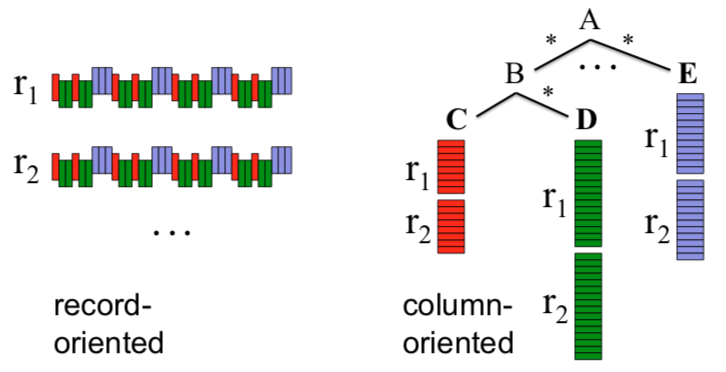

>[Back to Week Menu](README.md)
>
>Previous Theme: [Best practices](bigquery_best_practices.md)
>
>Next Theme: [BigQuery Machine Learning](bigquery_ml.md)  

## Internals

_[Video source](https://youtu.be/eduHi1inM4s)_

_[Additional source](https://cloud.google.com/blog/products/data-analytics/new-blog-series-bigquery-explained-overview)_

### BigQuery Architecture

BigQuery is built on 4 infrastructure technologies.
* ***Dremel***: the _compute_ part of BQ. It executes the SQL queries.
  * Dremel turns SQL queries into _execution trees_. The leaves of these trees are called _slots_ and the branches are called _mixers_.
  * The _slots_ are in charge of reading data from storage and perform calculations.
  * The _mixers_ perform aggregation.
  * Dremel dinamically apportions slots to queries as needed, while maintaining fairness for concurrent queries from multiple users.
* ***Colossus***: Google's global storage system.
  * BQ leverages a _columnar storage format_ and compression algorithms to store data.
  * Colossus is optimized for reading large amounts of structured data.
  * Colossus also handles replication, recovery and distributed management.
* ***Jupiter***: the network that connects Dremel and Colossus.
  * Jupiter is an in-house network technology created by Google which is used for interconnecting its datacenters.
* ***Borg***: an orchestration solution that handles everything.
  * Borg is a precursor of Kubernetes.

_[Back to the top](#internals)_

### Column-oriented vs record-oriented storage

Traditional methods for tabular data storage are ***record-oriented*** (also known as _row-oriented_). Data is read sequentially row by row and then the columns are accessed per row. An example of this is a CSV file: each new line in the file is a record and all the info for that specific record is contained within that line.

BigQuery uses a ***columnar storage format***. Data is stored according to the columns of the table rather than the rows. This is beneficial when dealing with massive amounts of data because it allows us to discard right away the columns we're not interested in when performing queries, thus reducing the amount of processed data.

When performing queries, Dremel modifies them in order to create an _execution tree_: parts of the query are assigned to different mixers which in turn assign even smaller parts to different slots which will access Colossus and retrieve the data.

The columnar storage format is perfect for this workflow as it allows very fast data retrieval from colossus by multiple workers, which then perform any needed computation on the retrieved datapoints and return them to the mixers, which will perform any necessary aggregation before returning that data to the root server, which will compose the final output of the query.

### Reference

- https://cloud.google.com/bigquery/docs/how-to
- https://research.google/pubs/pub36632/
- https://panoply.io/data-warehouse-guide/bigquery-architecture/
- https://www.goldsborough.me/distributed-systems/2019/05/18//21-09-00-a_look_at_dremel/

_[Back to the top](#internals)_