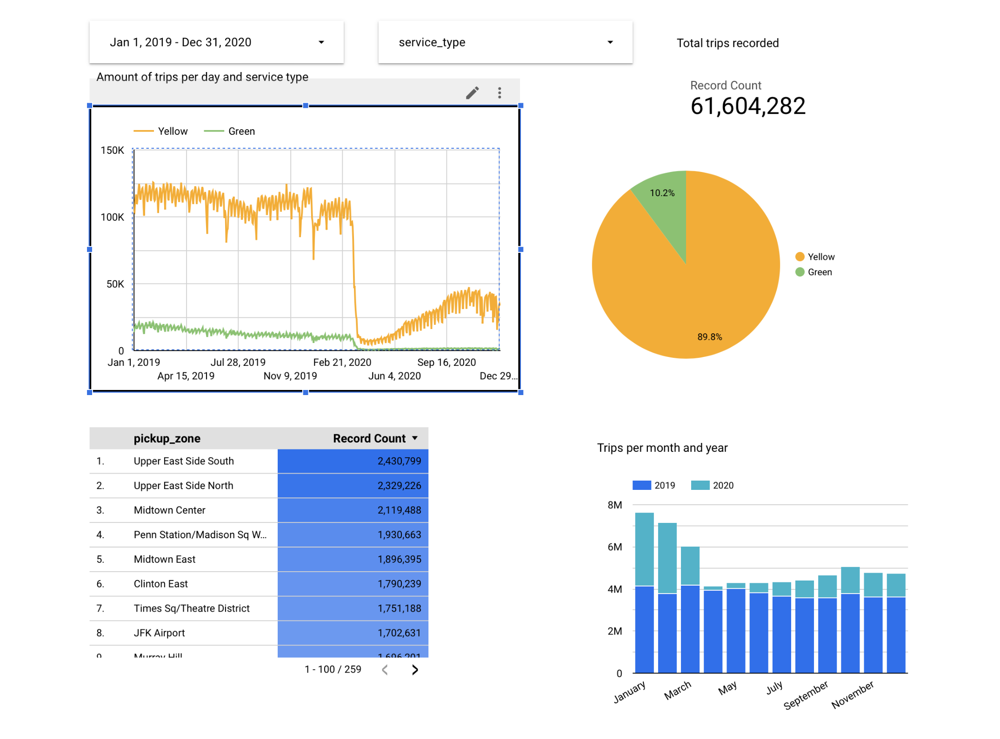

>[Back to Week Menu](README.md)
>
>Previous Theme: [Deployment of a dbt project](dbt_deployment.md)
>
> [Homework](../cohorts/2023/week_4_analytics_engineering/homework.md)

## Data visualization

After creating our models, transforming the data and deploying the models, we will now ***visualize*** the data.

### Google Data Studio

_Video sources: [1](https://www.youtube.com/watch?v=39nLTs74A3E&list=PL3MmuxUbc_hJed7dXYoJw8DoCuVHhGEQb&index=42)_, [2](https://www.youtube.com/watch?v=BnLkrA7a6gM&list=PL3MmuxUbc_hJed7dXYoJw8DoCuVHhGEQb&index=43)

[Google Data Studio](https://datastudio.google.com/) (GDS) is an online tool for converting data into ***reports*** and ***dashboards***.

1. In first place we will create a ***Data Source***:
    > Create -> Data Source -> BigQuery
    >
    > Select our table: `production.fact_trips`
    >
    > Connect

    For creating a dashboard using all data from `production.fact_trips` is needed to change default var 'is_test_run' from true to false for yellow and green models:
    ```
    -- dbt build --m <model.sql> --var 'is_test_run: false'
    
    
      limit 100
    
    
    ```
2. After creating the data source, a new window will open with the _dimensions_ (table columns), the type of each dimension and the default aggregation for each dimension. You may change the default aggregation as you see fit for each dimension. (Change 'default aggregation' for `dropoff_locationid`, `pickup_locationid`, `ratecodeid`, `payment_type`, `trip_type`, `vendorid` from **Sum** to **None**).
3. A ***Report*** is essentially an empty canvas which can be filled with can be filled with different widgets. The widgets that display data are called ***Charts***; widgets that modify the behavior of other charts are called ***Controls***. There are additional widgets for text, images and other elements to help improve the looks and readability of the report.

    > Press `Create report`

    A new window will open which will allow us to design our own custom report. An example table is already provided but you may delete it because we will be creating our own from scratch.
5. Add the first widget to the report. We want to show the **amount of trips per day**, so we'll choose a _Time Series Chart_. GDS will pick up the most likely dimensions for the chart, which for `fact_trips` happens to be `pickup_datetime`, but we need to add an additional dimension for breaking down the data, so we will drag an drop `service_type` into the widget sidebar, which should update with 2 lines, one for yellow taxi and another one for green taxi data. You may also move and resize the chart.

    

5. You may notice that the vast majority of trips are concentrated in a small interval; this is due to dirty data which has bogus values for `pickup_datetime`. We can filter out these bogus values by adding a _Date Range Control_, which we can drag and drop anywhere in the report, and then set the start date to January 1st 2019 and the end date to December 31st 2020.

    

    >Note: Controls affect all the Charts in the report.

6. Clicking on a chart will open the chart's sidebar with 2 tabs: the _Data_ tab contains all the specifics of the data to be displayed and the _Style_ tab allows us to change the appearance of the chart.

7. You may also add a text widget as a title for the chart.

8. We will now add a _Scorecard With Compact Numbers_ with the total record count in `fact_trips`, a _Pie chart_ displaying the `service_type` dimension using the record count metric and a _Table With Heatmap_ using `pickup_zone` as its dimension.

9. We will also add a _Stacked Column Bar_ showing trips per month. Since we do not have that particular dimension, what we can do instead is to create a new field that will allow us to filter by month:
   1. In the _Available Fields_ sidebar, click on _Add a field_ at the bottom.
   2. Name the new field `pickup_month`.
   3. In the _Formula_ field, type `MONTH(pickup_datetime)`.
   4. Click on _Save_ and then on _Done_.
   5. Back in the main page, drag the new `pickup_month` field from the _Available fields_ sidebar to the _Dimension_ field in the _Data_ sidebar. Get rid of all breakdown dimensions.

10. Our bar chart will now display trips per month but we still want to discriminate by year:

    1. Add a new field and name it `pickup_year`.
    2. Type in the formula `YEAR(pickup_datetime)`.
    3. Click on _Save_ and _Done_.
    4. Add the `pickup_year` field as a breakdown dimension for the bar chart.
    5. Change the _Sort_ dimension to `pickup_month` and make it ascending.

11. Finally, we will add a _Drop-Down List Control_ and drag the `service_type` dimension to _Control field_. The drop-down control will now allow us to choose yellow, green or both taxi types. We will also rename the report to _Trips analysis years 2019-2020_.



You may click on the _View_ button at the top to check how the shared report will look to the stakeholders. Sharing the report works similarly to Google Drive document sharing.

_[Back to the top](#data-visualization)_

### Metabase

GDS cannot be used for local databases. If you're developing locally, you may use the [Open Source Edition](https://www.metabase.com/start/oss/) of [Metabase](https://www.metabase.com/).

You may run Metabase on Docker or running a local JAR file. The main UI is a website for which a username and a database connection must be provided.

In Metabase, charts are called ***questions***. Questions have 3 components:
* ***Data***: the data we will use for the question. Multiple data sources can be configured as well as custom columns that allow us to apply formulas to regular columns.
* ***Filters***: reduces the amount of records to use in the question by defining criteria for qualification, such as specific time periods.
* ***Summarize***: contains predefined aggregations and formulas to manipulate the results, such as counting records by specific dates. Custom summarization formulas can also be defined.

Once the 3 components have been defined, a preview will be shown. Once you're ready, you may click the _Visualize_ button to generate the chart.

Questions can be saved in _collections_ and displayed in _dashboards_.

_[Back to the top](#data-visualization)_