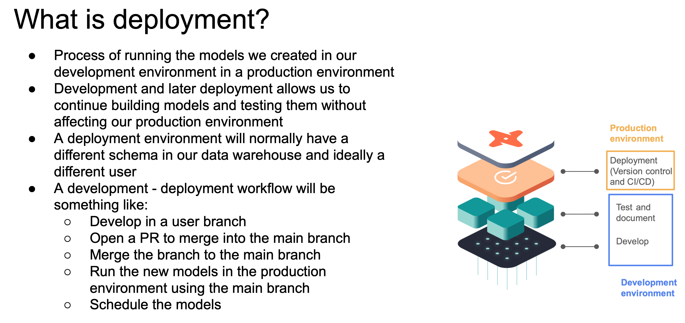
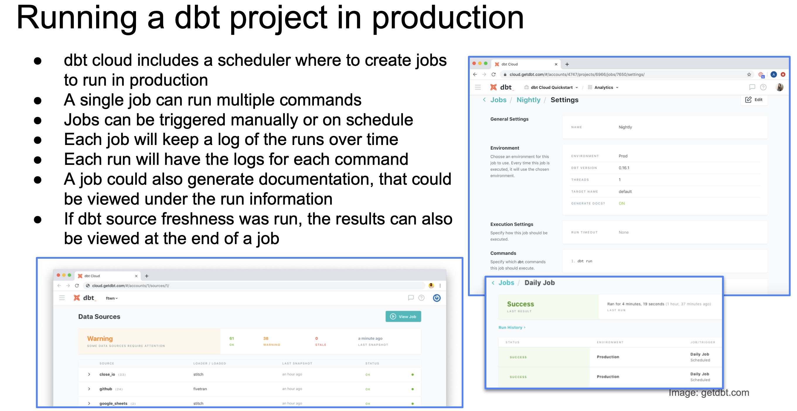
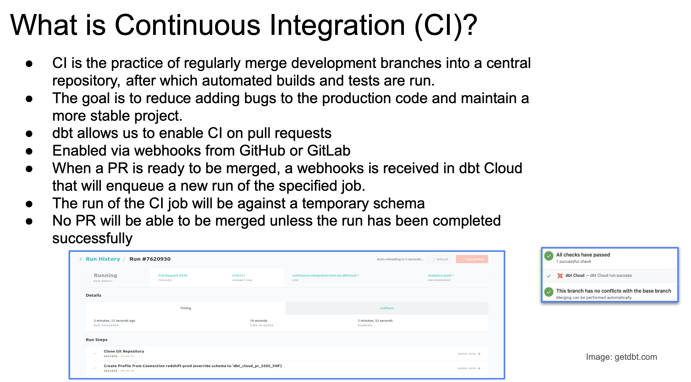

>[Back to Week Menu](README.md)
>
>Previous Theme: [Testing and documenting dbt models](test_doc_dbt_models.md)
>
>Next Theme: [Google Data Studio](google_data_studio.md)

## Deployment of a dbt project

_Video sources: [1](https://www.youtube.com/watch?v=rjf6yZNGX8I&list=PL3MmuxUbc_hJed7dXYoJw8DoCuVHhGEQb&index=40)_, [2](https://www.youtube.com/watch?v=Cs9Od1pcrzM&list=PL3MmuxUbc_hJed7dXYoJw8DoCuVHhGEQb&index=41)

### Deployment basics

If you remember from the [beginning of this lesson](what_is_dbt.md), the goal of dbt is to introduce good software engineering practices by defining a ***deployment workflow***.



We've seen the _Develop_ and _Test And Document_ stages of the workflow. We will now cover ***deployment***.

***Deployment***:
- Process of running the models we created in our development environment in a ***production environment***.
- Separating the development and production environments allows us to continue building and testing models **without affecting the models in production**.
- Normally, a production environment will have a **different schema** in our Data Warehouse and ideally a **different user**.
- The ***deployment workflow*** defines the steps used to create a model from scratch and bring it to production. Here's a deployment workflow example:
  1. Develop in a _user branch_.
  2. Open a PR to merge into the _main branch_.
  3. _Merge_ the user branch to the main branch.
  4. _Run_ the new models in the _production_ environment using the _main_ branch.
  5. _Schedule_ the models.

_[Back to the top](#deployment-of-a-dbt-project)_

### Running a dbt project in production



dbt projects are usually deployed in the form of ***jobs***:
* A ***job*** is a collection of _commands_ such as `build` or `test`. A job may contain one or more commands.
* Jobs can be triggered manually or on schedule.
    * dbt Cloud has a scheduler which can run jobs for us, but other tools such as Airflow or cron can be used as well.
* Each job will keep a log of the runs over time, and each run will keep the logs for each command.
* A job may also be used to generate documentation, which may be viewed under the run information.
* If the `dbt source freshness` command was run, the results can also be viewed at the end of a job.

_[Back to the top](#deployment-of-a-dbt-project)_

### Continuous Integration



Another good software engineering practice that dbt enables is ***Continuous Integration*** (CI): the practice of regularly merging development branches into a central repository, after which automated builds and tests are run. The goal of CI is to reduce adding bugs to the production code and maintain a more stable project.

CI is built on jobs: a CI job will do things such as build, test, etc. We can define CI jobs which can then be triggered under certain circumstances to enable CI.

dbt makes use of GitHub/GitLab's Pull Requests to enable CI via [webhooks](https://www.wikiwand.com/en/Webhook). When a PR is ready to be merged, a webhook is received in dbt Cloud that will enqueue a new run of a CI job. This run will usually be against a temporary schema that has been created explicitly for the PR. If the job finishes successfully, the PR can be merged into the main branch, but if it fails the merge will not happen.

CI jobs can also be scheduled with the dbt Cloud scheduler, Airflow, cron and a number of additional tools.

_[Back to the top](#deployment-of-a-dbt-project)_

### Deployment using dbt Cloud

- In dbt Cloud, you might have noticed that after the first commit, the `main` branch becomes read-only and forces us to create a new branch if we want to keep developing. dbt Cloud does this to enforce us to open PRs for CI purposes rather than allowing merging to `main` straight away.

- In order to properly establish a deployment workflow, we must define ***environments*** within dbt Cloud. In the sidebar, under _Environments_, you will see that a default _Development_ environment is already generated, which is the one we've been using so far.

- Create a new _Production_ environment of type _Deployment_:
  > Deploy -> Environments -> Create Environment
  > 
  > Name: Production
  > 
  > Environment Type: Deployment
  > 
  > dbt Version: 1.4 (latest)
  > 
  > Dataset: production

- Create Job to run in _Production_:
  > Deploy -> Jobs -> Create Job
  > 
  > Job Name: dbt build
  > 
  > Environment: Production
  > 
  > dbt Version: Inherited from Production (1.4 (latest))
  > 
  > Target Name: default
  >
  > Check `Generate docs on run`
  > 
  > (If use 'source freshness', then check `Run source freshness`)
  > 
  > Commands:
  > ```
  > dbt seed
  > dbt run
  > dbt test
  > ```
  > 
  > Schedule: Every day, every 6 hours
  > 
  > Save
- Run job: press `Run now`
- After completing you can access the **current state** of it as well as the **logs**
- _View Documentation_ button will open a tab with the generated docs
- Under _Account settings_ > _Projects_, you may edit the project in order to modify the _Documentation_ field under _Artifacts_; you should see a drop down menu which should contain the job we created which generates the docs. After saving the changes and reloading the dbt Cloud website, you should now have a _Documentation_ section in the sidebar.

_[Back to the top](#deployment-of-a-dbt-project)_

### Deployment using dbt Core (local)

In dbt Core, environments are defined in the `profiles.yml` file. Assuming you've defined a ***target*** (an environment) called `prod`, you may build your project agains it using the `dbt build -t prod` command.

You may learn more about how to set up the `profiles.yml` file [in this link](https://docs.getdbt.com/dbt-cli/configure-your-profile).

_[Back to the top](#deployment-of-a-dbt-project)_