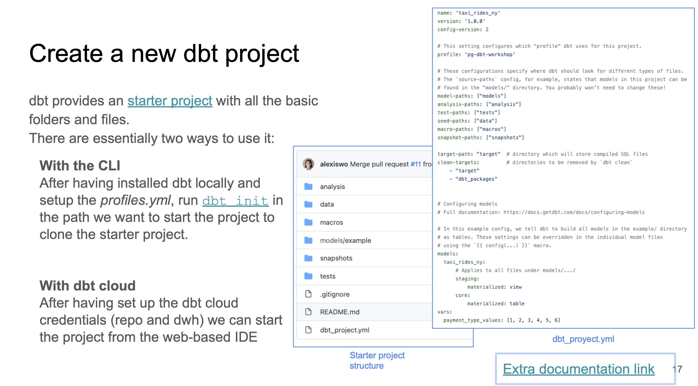

>[Back to Week Menu](README.md)
>
>Previous Theme: [Starting a dbt project: Project's goal & Preparation](goal_preparation.md)
>
>Next Theme: [Starting a dbt project: Using Postgres + dbt core](dbt_project_pg_dbt_core.md)

# Starting a dbt project

## Setting up dbt for using BigQuery (Alternative A - preferred)
_[Video source](https://www.youtube.com/watch?v=iMxh6s_wL4Q&list=PL3MmuxUbc_hJed7dXYoJw8DoCuVHhGEQb&index=36)_

- Go to **BigQuery** and create 2 new empty datasets for your project:
  - a _development_ dataset and 
  - a _production_ dataset.
  
  Name them any way you'd like.
- Create a **dbt cloud account** using [this link](https://www.getdbt.com/signup/) and connect to your warehouse [following these instructions](https://docs.getdbt.com/docs/dbt-cloud/cloud-configuring-dbt-cloud/cloud-setting-up-bigquery-oauth). More detailed instructions in [dbt_cloud_setup.md](dbt_cloud_setup.md). When asked, connnect the project to your _development_ dataset.
- Make sure that you set up a GitHub repo for your project. In _Account settings_ > _Projects_ you can select your project and change its settings, such as _Name_ or _dbt Project Subdirectoy_, which can be convenient if your repo is previously populated and would like to keep the dbt project in a single subfolder.
- In the IDE windows, press the green _Initilize_ button to create the project files.
- In order to edit files need to create a new branch and choose it in IDE.
- Inside `dbt_project.yml`, change the project name both in the `name` field as well as right below the `models:` block. You may comment or delete the `example` block at the end.

_Optional_: If you feel more comfortable developing locally you could use a local installation of dbt as well. You can follow the [official dbt documentation](https://docs.getdbt.com/dbt-cli/installation) or follow the [dbt with BigQuery on Docker](docker_setup/README.md) guide to setup dbt locally on docker. You will need to install the latest version (1.0) with the BigQuery adapter (dbt-bigquery). 

_[Back to the top](#starting-a-dbt-project)_