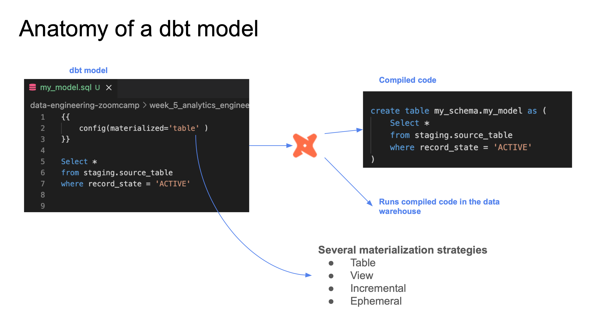
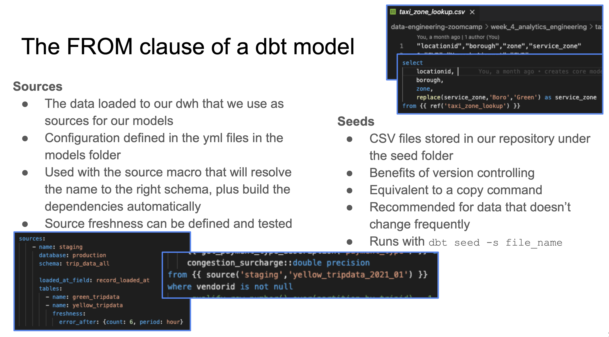
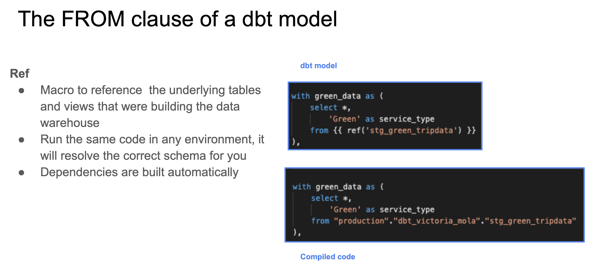

>[Back to Week Menu](README.md)
>
>Previous Theme: [Starting a dbt project: Using Postgres + dbt core](dbt_project_pg_dbt_core.md)
>
>Next Theme: [Testing and documenting dbt models](test_doc_dbt_models.md)

## Developing with dbt

_[Video source](https://www.youtube.com/watch?v=UVI30Vxzd6c&list=PL3MmuxUbc_hJed7dXYoJw8DoCuVHhGEQb&index=38)_

### Anatomy of a dbt model



dbt models are mostly written in SQL (remember that a dbt model is essentially a `SELECT` query) but they also make use of the [Jinja templating language](https://jinja.palletsprojects.com/en/3.0.x/) for templates.

Here's an example dbt model:

```sql
{{
    config(materialized='table')
}}

SELECT *
FROM staging.source_table
WHERE record_state = 'ACTIVE'
```

* In the Jinja statement defined within the `{{ }}` block we call the [`config()` function](https://docs.getdbt.com/reference/dbt-jinja-functions/config).
    * More info about Jinja macros for dbt [in this link](https://docs.getdbt.com/docs/building-a-dbt-project/jinja-macros).
* We commonly use the `config()` function at the beginning of a model to define a ***materialization strategy***: a strategy for persisting dbt models in a warehouse.
    * The `table` strategy means that the model will be rebuilt as a table on each run.
    * We could use a `view` strategy instead, which would rebuild the model on each run as a SQL view.
    * The `incremental` strategy is essentially a `table` strategy but it allows us to add or update records incrementally rather than rebuilding the complete table on each run.
    * The `ephemeral` strategy creates a _[Common Table Expression](https://www.essentialsql.com/introduction-common-table-expressions-ctes/)_ (CTE).
    * You can learn more about materialization strategies with dbt [in this link](https://docs.getdbt.com/docs/building-a-dbt-project/building-models/materializations). Besides the 4 common `table`, `view`, `incremental` and `ephemeral` strategies, custom strategies can be defined for advanced cases.

dbt will compile this code into the following SQL query:

```sql
CREATE TABLE my_schema.my_model AS (
    SELECT *
    FROM staging.source_table
    WHERE record_state = 'ACTIVE'
)
```

After the code is compiled, dbt will run the compiled code in the Data Warehouse.

Additional model properties are stored in YAML files. Traditionally, these files were named `schema.yml` but later versions of dbt do not enforce this as it could lead to confusion.

_[Back to the top](#developing-with-dbt)_

### The FROM clause

The `FROM` clause within a `SELECT` statement defines the _sources_ of the data to be used.



The following sources are available to dbt models:

* ***Sources***: The data loaded within our Data Warehouse.
    * We can access this data with the `source()` function.
    * The `sources` key in our YAML file contains the details of the databases that the `source()` function can access and translate into proper SQL-valid names.
        * Additionally, we can define "source freshness" to each source so that we can check whether a source is "fresh" or "stale", which can be useful to check whether our data pipelines are working properly.
    * More info about sources [in this link](https://docs.getdbt.com/docs/building-a-dbt-project/using-sources).
* ***Seeds***: CSV files which can be stored in our repo under the `seeds` folder.
    * The repo gives us version controlling along with all of its benefits.
    * Seeds are best suited to static data which changes infrequently.
    * Seed usage:
        1. Add a CSV file to your `seeds` folder.
        1. Run the [`dbt seed` command](https://docs.getdbt.com/reference/commands/seed) to create a table in our Data Warehouse.
            * If you update the content of a seed, running `dbt seed` will append the updated values to the table rather than substituing them. Running `dbt seed --full-refresh` instead will drop the old table and create a new one.
        1. Refer to the seed in your model with the `ref()` function.
    * More info about seeds [in this link](https://docs.getdbt.com/docs/building-a-dbt-project/seeds).

Here's an example of how you would declare a source in a `.yml` file:

```yaml
sources:
    - name: staging
      database: production
      schema: trips_data_all

      loaded_at_field: record_loaded_at
      tables:
        - name: green_tripdata
        - name: yellow_tripdata
          freshness:
            error_after: {count: 6, period: hour}
```

And here's how you would reference a source in a `FROM` clause:

```sql
FROM {{ source('staging','yellow_tripdata') }}
```
* The first argument of the `source()` function is the source name, and the second is the table name.

In the case of seeds, assuming you've got a `taxi_zone_lookup.csv` file in your `seeds` folder which contains `locationid`, `borough`, `zone` and `service_zone`:

```sql
SELECT
    locationid,
    borough,
    zone,
    replace(service_zone, 'Boro', 'Green') as service_zone
FROM {{ ref('taxi_zone_lookup) }}
```



The `ref()` function references underlying tables and views in the Data Warehouse. When compiled, it will automatically build the dependencies and resolve the correct schema fo us. So, if BigQuery contains a schema/dataset called `dbt_dev` inside the `my_project` database which we're using for development and it contains a table called `stg_green_tripdata`, then the following code...

```sql
WITH green_data AS (
    SELECT *,
        'Green' AS service_type
    FROM {{ ref('stg_green_tripdata') }}
),
```

...will compile to this:

```sql
WITH green_data AS (
    SELECT *,
        'Green' AS service_type
    FROM "my_project"."dbt_dev"."stg_green_tripdata"
),
```
* The `ref()` function translates our references table into the full reference, using the `database.schema.table` structure.
* If we were to run this code in our production environment, dbt would automatically resolve the reference to make it point to our production schema.

_[Back to the top](#developing-with-dbt)_

### Defining a source and creating a model

We will now create our first model.

1. We will begin by creating 2 new folders under our `models` folder:
   * `staging` will have the raw models.
   * `core` will have the models that we will expose at the end to the BI tool, stakeholders, etc.

2. Under `staging` we will add 2 new files: `sgt_green_tripdata.sql` and `schema.yml`:
  ```yaml
  # schema.yml
  
  version: 2
  
  sources:
      - name: staging
        database: your_project
        schema: trips_data_all
  
        tables:
            - name: green_tripdata
            - name: yellow_tripdata
  ```
  * We define our ***sources*** in the `schema.yml` model properties file.
  * We are defining the 2 tables for yellow and green taxi data as our sources.
  ```sql
  -- sgt_green_tripdata.sql
  
  {{ config(materialized='view') }}
  
  select * from {{ source('staging', 'green_tripdata') }}
  limit 100
  ```
  * This query will create a ***view*** in the `staging` dataset/schema in our database.
  * We make use of the `source()` function to access the green taxi data table, which is defined inside the `schema.yml` file.

  The advantage of having the properties in a separate file is that we can easily modify the `schema.yml` file to change the database details and write to different databases without having to modify our `sgt_green_tripdata.sql` file.

3. **Run the model** (either locally or from dbt Cloud):
  * Run all models:
  ```
  dbt run
  ```
  or
  * Run specific model (or `dbt run --select <name>`):
  ```
  dbt run -m <model's name>
  ```
  i.e.:
  ```
  dbt run -m stg_green_tripdata
  ```

4. Define the fields in model `stg_green_tripdata` instead of `*`:
  ```sql
      -- identifiers
      cast(vendorid as integer) as vendorid,
      cast(ratecodeid as integer) as ratecodeid,
      cast(pulocationid as integer) as  pickup_locationid,
      cast(dolocationid as integer) as dropoff_locationid,
      
      -- timestamps
      cast(lpep_pickup_datetime as timestamp) as pickup_datetime,
      cast(lpep_dropoff_datetime as timestamp) as dropoff_datetime,
      
      -- trip info
      store_and_fwd_flag,
      cast(passenger_count as integer) as passenger_count,
      cast(trip_distance as numeric) as trip_distance,
      cast(trip_type as integer) as trip_type,
      
      -- payment info
      cast(fare_amount as numeric) as fare_amount,
      cast(extra as numeric) as extra,
      cast(mta_tax as numeric) as mta_tax,
      cast(tip_amount as numeric) as tip_amount,
      cast(tolls_amount as numeric) as tolls_amount,
      cast(ehail_fee as numeric) as ehail_fee,
      cast(improvement_surcharge as numeric) as improvement_surcharge,
      cast(total_amount as numeric) as total_amount,
      cast(payment_type as integer) as payment_type,
      cast(congestion_surcharge as numeric) as congestion_surcharge
  ```
5. Run model:
  ```
  dbt run --select stg_green_tripdata
  ```

_[Back to the top](#developing-with-dbt)_

### Macros

***Macros*** are pieces of code in Jinja that can be reused, similar to functions in other languages.

dbt already includes a series of macros like `config()`, `source()` and `ref()`, but custom macros can also be defined.

Macros allow us to add features to SQL that aren't otherwise available, such as:
* Use control structures such as `if` statements or `for` loops.
* Use environment variables in our dbt project for production.
* Operate on the results of one query to generate another query.
* Abstract snippets of SQL into reusable macros.

Macros are defined in separate `.sql` files which are typically stored in a `macros` directory.

There are 3 kinds of Jinja _delimiters_:
* `` for ***statements*** (control blocks, macro definitions)
* `{{ ... }}` for ***expressions*** (literals, math, comparisons, logic, macro calls...)
* `{# ... #}` for comments.

Here's a macro definition example:

```sql
{# This macro returns the description of the payment_type #}



    case {{ payment_type }}
        when 1 then 'Credit card'
        when 2 then 'Cash'
        when 3 then 'No charge'
        when 4 then 'Dispute'
        when 5 then 'Unknown'
        when 6 then 'Voided trip'
    end


```
* The `macro` keyword states that the line is a macro definition. It includes the name of the macro as well as the parameters.
* The code of the macro itself goes between 2 statement delimiters. The second statement delimiter contains an `endmacro` keyword.
* In the code, we can access the macro parameters using expression delimiters.
* The macro returns the ***code*** we've defined rather than a specific value.

Here's how we use the macro:
```sql
select
    {{ get_payment_type_description('payment-type') }} as payment_type_description,
    congestion_surcharge::double precision
from {{ source('staging','green_tripdata') }}
where vendorid is not null
```
* We pass a `payment-type` variable which may be an integer from 1 to 6.

And this is what it would compile to:
```sql
select
    case payment_type
        when 1 then 'Credit card'
        when 2 then 'Cash'
        when 3 then 'No charge'
        when 4 then 'Dispute'
        when 5 then 'Unknown'
        when 6 then 'Voided trip'
    end as payment_type_description,
    congestion_surcharge::double precision
from {{ source('staging','green_tripdata') }}
where vendorid is not null
```
* The macro is replaced by the code contained within the macro definition as well as any variables that we may have passed to the macro parameters.

_[Back to the top](#developing-with-dbt)_

### Create macro (in dbt Cloud):
1. Go to `macros` folder and create file `get_payment_type_description.sql`
2. Insert data:
    ```sql
    {# This macro returns the description of the payment_type #}
    
    
    
        case {{ payment_type }}
            when 1 then 'Credit card'
            when 2 then 'Cash'
            when 3 then 'No charge'
            when 4 then 'Dispute'
            when 5 then 'Unknown'
            when 6 then 'Voided trip'
        end
    
    
    ```
3. Call this macro in `stg_green_tripdata.sql`:
    ```sql
   ...
    cast(payment_type as integer) as payment_type,
    {{ get_payment_type_description('payment_type') }} as payment_type_description,
    cast(congestion_surcharge as numeric) as congestion_surcharge
   ..
    ```
4. Run model again:
  ```
  dbt run --select stg_green_tripdata
  ```

In `target` folder are stored all compiled files.

_[Back to the top](#developing-with-dbt)_

### Packages
- Like libraries in other languages
- Standalone dbt projects with models and macros that tackle a specific problem area
- By adding a package to your project, the package's models and macros will become part of your own project
- To use a package, you must first create a `packages.yml` file in the root of your work directory. Here's an example:
    ```yaml
    packages:
      - package: dbt-labs/dbt_utils
        version: 0.8.0
    ```
  
- Then you need to install them by running the `dbt deps` command either locally or on dbt Cloud.
- A list of useful packages can be found in the [dbt package hub](https://hub.getdbt.com/).
- You may access macros inside a package in a similar way to how Python access class methods:
    ```sql
    select
        {{ dbt_utils.surrogate_key(['vendorid', 'lpep_pickup_datetime']) }} as tripid,
        cast(vendorid as integer) as vendorid,
        -- ...
    ```
  * The `surrogate_key()` macro generates a hashed [surrogate key](https://www.geeksforgeeks.org/surrogate-key-in-dbms/) with the specified fields in the arguments.

### Import package:
1. In root dir of project create file `packages.yml`:
    ```yaml
    packages:
      - package: dbt-labs/dbt_utils
        version: 0.8.0
    ```
2. Run `dbt deps` to install packages
3. Add to `stg_green_tripdata.sql` unique key using of `dbt_utils.surrogate_key`:
    ```sql
    select
        -- identifiers
        {{ dbt_utils.surrogate_key(['vendorid', 'lpep_pickup_datetime']) }} as tripid,
        cast(vendorid as integer) as vendorid,
    ```
4. Run model again:
  ```
  dbt run --select stg_green_tripdata
  ```
_[Back to the top](#developing-with-dbt)_

### Variables

Like most other programming languages, ***variables*** can be defined and used across our project.

Variables can be defined in 2 different ways:
* Under the `vars` keyword inside `dbt_project.yml`.
    ```yaml
    vars:
        payment_type_values: [1, 2, 3, 4, 5, 6]
    ```
* As arguments when building or running your project.
    ```sh
    dbt build --m <your-model.sql> --var 'is_test_run: false'
    ```

Variables can be used with the `var()` macro. For example:
```sql


    limit 100


```
* In this example, the default value for `is_test_run` is `true`; in the absence of a variable definition either on the `dbt_project.yml` file or when running the project, then `is_test_run` would be `true`.
* Since we passed the value `false` when runnning `dbt build`, then the `if` statement would evaluate to `false` and the code within would not run.

### Add variables:
1. Add to the end of the file `stg_green_tripdata.sql`:
    ```sql
    where vendorid is not null 
    -- dbt build --m <model.sql> --var 'is_test_run: false'
    
    
      limit 100
    
    
    ```
2. Run model (use default=true as var 'is_test_run'):
  ```
  dbt run --select stg_green_tripdata
  ```
3. Run model with var(use 'is_test_run'=false):
  ```
  dbt run --select stg_green_tripdata --var 'is_test_run: false'
  ```

_[Back to the top](#developing-with-dbt)_

### Add second model (stg_yellow_tripdata)
1. Create file `stg_yellow_tripdata.sql` in `staging` folder
2. Add:
    ```sql
    {{ config(materialized='view') }}
    
    select
        -- identifiers
        {{ dbt_utils.surrogate_key(['vendorid', 'lpep_pickup_datetime']) }} as tripid,
        cast(vendorid as integer) as vendorid,
        cast(ratecodeid as integer) as ratecodeid,
        cast(pulocationid as integer) as  pickup_locationid,
        cast(dolocationid as integer) as dropoff_locationid,
        
        -- timestamps
        cast(tpep_pickup_datetime as timestamp) as pickup_datetime,
        cast(tpep_dropoff_datetime as timestamp) as dropoff_datetime,
        
        -- trip info
        store_and_fwd_flag,
        cast(passenger_count as integer) as passenger_count,
        cast(trip_distance as numeric) as trip_distance,
        -- yellow cabs are always street-hail
        1 as trip_type,
        
        -- payment info
        cast(fare_amount as numeric) as fare_amount,
        cast(extra as numeric) as extra,
        cast(mta_tax as numeric) as mta_tax,
        cast(tip_amount as numeric) as tip_amount,
        cast(tolls_amount as numeric) as tolls_amount,
        cast(0 as numeric) as ehail_fee,
        cast(ehail_fee as numeric) as ehail_fee,
        cast(improvement_surcharge as numeric) as improvement_surcharge,
        cast(total_amount as numeric) as total_amount,
        cast(payment_type as integer) as payment_type,
        {{ get_payment_type_description('payment_type') }} as payment_type_description,
        cast(congestion_surcharge as numeric) as congestion_surcharge
    from {{source('staging', 'yellow_tripdata')}}
    where vendorid is not null 
    -- dbt build --m <model.sql> --var 'is_test_run: false'
    
    
      limit 100
    
    
    ```
3. Run models:
    ```
    dbt run --var 'is_test_run: false'
    ```

_[Back to the top](#developing-with-dbt)_

### Creating and Using DBT Seed (Referencing older models in new models)

>Note: you will need the [Taxi Zone Lookup Table seed](https://s3.amazonaws.com/nyc-tlc/misc/taxi+_zone_lookup.csv), the [staging models and schema](https://github.com/DataTalksClub/data-engineering-zoomcamp/tree/main/week_4_analytics_engineering/taxi_rides_ny/models/staging) and the [macro files](https://github.com/DataTalksClub/data-engineering-zoomcamp/tree/main/week_4_analytics_engineering/taxi_rides_ny/macros) for this section.

1. Add file `taxi_zone_lookup.csv` to `seeds` folder (delete symbol `+` from filename).
2. Run `dbt seed` to create a table in the db from csv-file (In BQ created table `taxi_zone_lookup`).
3. Add to `dbt_project` (define field `locationid` as type `numeric` in seed `taxi_zone_lookup`):
    ```
    seeds: 
        taxi_rides_ny:
            taxi_zone_lookup:
                +column_types:
                    locationid: numeric
    ```
4. Change something in csv file and run `dbt seed --full-refresh` to recreate a table
5. Create a model based on the `taxi_zone_lookup` seed file `dim_zones.sql`. Create file `dim_zones.sql` in folder `core`:
    ```sql
    {{ config(materialized='table') }}
    
    
    select 
        locationid, 
        borough, 
        zone, 
        replace(service_zone,'Boro','Green') as service_zone
    from {{ ref('taxi_zone_lookup') }}
    ```
6. Create file `fact_trips.sql` in folder `core`:
    ```sql
    {{ config(materialized='table') }}
    
    with green_data as (
        select *, 
            'Green' as service_type 
        from {{ ref('stg_green_tripdata') }}
    ), 
    
    yellow_data as (
        select *, 
            'Yellow' as service_type
        from {{ ref('stg_yellow_tripdata') }}
    ), 
    
    trips_unioned as (
        select * from green_data
        union all
        select * from yellow_data
    ), 
    
    dim_zones as (
        select * from {{ ref('dim_zones') }}
        where borough != 'Unknown'
    )
    select 
        trips_unioned.tripid, 
        trips_unioned.vendorid, 
        trips_unioned.service_type,
        trips_unioned.ratecodeid, 
        trips_unioned.pickup_locationid, 
        pickup_zone.borough as pickup_borough, 
        pickup_zone.zone as pickup_zone, 
        trips_unioned.dropoff_locationid,
        dropoff_zone.borough as dropoff_borough, 
        dropoff_zone.zone as dropoff_zone,  
        trips_unioned.pickup_datetime, 
        trips_unioned.dropoff_datetime, 
        trips_unioned.store_and_fwd_flag, 
        trips_unioned.passenger_count, 
        trips_unioned.trip_distance, 
        trips_unioned.trip_type, 
        trips_unioned.fare_amount, 
        trips_unioned.extra, 
        trips_unioned.mta_tax, 
        trips_unioned.tip_amount, 
        trips_unioned.tolls_amount, 
        trips_unioned.ehail_fee, 
        trips_unioned.improvement_surcharge, 
        trips_unioned.total_amount, 
        trips_unioned.payment_type, 
        trips_unioned.payment_type_description, 
        trips_unioned.congestion_surcharge
    from trips_unioned
    inner join dim_zones as pickup_zone
    on trips_unioned.pickup_locationid = pickup_zone.locationid
    inner join dim_zones as dropoff_zone
    on trips_unioned.dropoff_locationid = dropoff_zone.locationid
    ```
7. Run `dbt build` to run all models with seeds (`dbt run` run only models)

The models we've created in the _staging area_ are for normalizing the fields of both green and yellow taxis. With normalized field names we can now join the 2 together in more complex ways.

The `ref()` macro is used for referencing any undedrlying tables and views that we've created, so we can reference seeds as well as models using this macro:

```sql
{{ config(materialized='table') }}

select
    locationid,
    borough,
    zone,
    replace(service_zone, 'Boro', 'Green') as service_zone
from {{ ref('taxi_zone_lookup') }}
```
* This model references the `taxi_zone_lookup` table created from the taxi zone lookup CSV seed.

```sql
with green_data as (
    select *, 
        'Green' as service_type 
    from {{ ref('stg_green_tripdata') }}
), 
```
* This snippet references the `sgt_green_tripdata` model that we've created before. Since a model outputs a table/view, we can use it in the `FROM` clause of any query.

You may check out these more complex "core" models [in this link](/taxi_rides_ny/models/core).

>Note: running `dbt run` will run all models but NOT the seeds. The `dbt build` can be used instead to run all seeds and models as well as tests, which we will cover later. Additionally, running `dbt run --select my_model` will only run the model itself, but running `dbt run --select +my_model` will run the model as well as all of its dependencies.

_[Back to the top](#developing-with-dbt)_