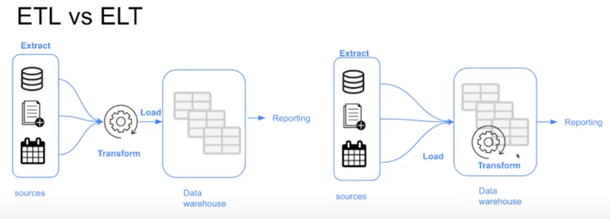

>[Back to Week Menu](README.md)
>
>Next Theme: 

## Introduction to Analytics Engineering
_[Video source](https://www.youtube.com/watch?v=uF76d5EmdtU&list=PL3MmuxUbc_hJed7dXYoJw8DoCuVHhGEQb&index=32)_

### What is Analytics Engineering?

**Data domain** developments:

1. Massively parallel processing (MPP) databases
   - Lower the cost of storage (made data storage and processing affordable and fast)
   - BigQuery, Snowflake, Redshift
2. Data-pipelines-as-a-service
    - Simplified the ETL process
    - Fivetran, Stitch
3. SQL-first / Version control systems
    - increased SQL awareness
    - Looker
4. Self service analytics
    - Mode
5. Data governance

The introduction of all of these tools changed the way the data teams work as well as the way that the stakeholders consume the data, creating a gap in the roles of the data team. Traditionally:

* The ***data engineer*** prepares and maintains the infrastructure the data team needs.
* The ***data analyst*** uses data to answer questions and solve problems (they are in charge of _today_).
* The ***data scientist*** predicts the future based on past patterns and covers the what-ifs rather than the day-to-day (they are in charge of _tomorrow_).

However, with the introduction of these tools, both data scientists and analysts find themselves writing more code even though they're not software engineers and writing code isn't their top priority.  Data engineers are good software engineers but they don't have the training in how the data is going to be used  by the business users.

The ***analytics engineer*** is the role that tries to fill the gap: it introduces the good software engineering practices to the efforts of data analysts and data scientists. The analytics engineer may be exposed to the following tools:
1. Data Loading (Stitch)
2. Data Storing (Data Warehouses)
3. Data Modeling (dbt, Dataform)
4. Data Presentation (BI tools like Looker, Mode, Tableau)

This lesson focuses on the last 2 parts: Data Modeling and Data Presentation.

_[Back to the top](#introduction-to-analytics-engineering)_

### Data Modeling Concepts

### ETL vs ELT

In lesson 2 we covered the difference between [ETL and ELT](../week_2_workflow_orchestration/data_lake.md#etl-vs-elt).

In this lesson we will cover the _transform_ step in the ELT process.

### Dimensional Modeling

[Ralph Kimball's Dimensional Modeling](https://www.wikiwand.com/en/Dimensional_modeling#:~:text=Dimensional%20modeling%20(DM)%20is%20part,use%20in%20data%20warehouse%20design.) is an approach to Data Warehouse design which focuses on 2 main points:
* Deliver data which is understandable to the business users.
* Deliver fast query performance.

Other goals such as reducing redundant data (prioritized by other approaches such as [3NF](https://www.wikiwand.com/en/Third_normal_form#:~:text=Third%20normal%20form%20(3NF)%20is,integrity%2C%20and%20simplify%20data%20management.) by [Bill Inmon](https://www.wikiwand.com/en/Bill_Inmon)) are secondary to these goals. Dimensional Modeling also differs from other approaches to Data Warehouse design such as [Data Vaults](https://www.wikiwand.com/en/Data_vault_modeling).

Dimensional Modeling is based around 2 important concepts:
* ***Fact Table***:
    * _Facts_ = _Measures_
    * Typically numeric values which can be aggregated, such as measurements or metrics.
        * Examples: sales, orders, etc.
    * Corresponds to a [_business process_ ](https://www.wikiwand.com/en/Business_process).
    * Can be thought of as _"verbs"_.
* ***Dimension Table***:
    * _Dimension_ = _Context_
    * Groups of hierarchies and descriptors that define the facts.
        * Example: customer, product, etc.
    * Corresponds to a _business entity_.
    * Can be thought of as _"nouns"_.
* Dimensional Modeling is built on a [***star schema***](https://www.wikiwand.com/en/Star_schema) with fact tables surrounded by dimension tables.

A good way to understand the _architecture_ of Dimensional Modeling is by drawing an analogy between dimensional modeling and a restaurant:
* Stage Area:
    * Contains the raw data.
    * Not meant to be exposed to everyone.
    * Similar to the food storage area in a restaurant.
* Processing area:
    * From raw data to data models.
    * Focuses in efficiency and ensuring standards.
    * Similar to the kitchen in a restaurant.
* Presentation area:
    * Final presentation of the data.
    * Exposure to business stakeholder.
    * Similar to the dining room in a restaurant.

_[Back to the top](#introduction-to-analytics-engineering)_