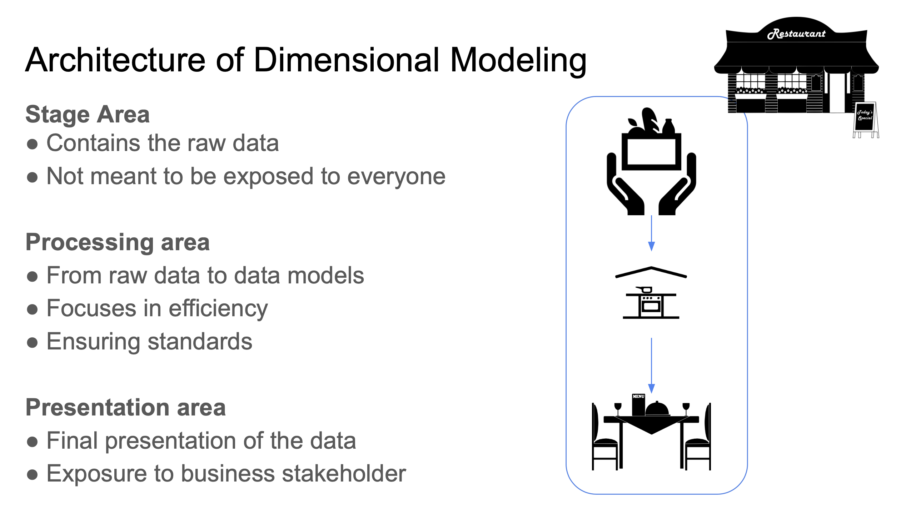

>[Back to Week Menu](README.md)
>
>Previous Theme: [Development of dbt models](dev_dbt_models.md)
>
>Next Theme: 

## Testing and documenting dbt models

_[Video source](https://www.youtube.com/watch?v=UishFmq1hLM&list=PL3MmuxUbc_hJed7dXYoJw8DoCuVHhGEQb&index=37)_

Testing and documenting are not required steps to successfully run models, but they are expected in any professional setting.

### Testing

Tests in dbt are ***assumptions*** that we make about our data.

In dbt, tests are essentially a `SELECT` query that will return the amount of records that fail because they do not follow the assumption defined by the test.

Tests are defined on a column in the model YAML files (like the `schema.yml` file we defined before). dbt provides a few predefined tests to check column values but custom tests can also be created as queries. Here's an example test:

```yaml
models:
  - name: stg_yellow_tripdata
    description: >
        Trips made by New York City's iconic yellow taxis. 
    columns:
        - name: tripid
        description: Primary key for this table, generated with a concatenation of vendorid+pickup_datetime
        tests:
            - unique:
                severity: warn
            - not_null:
                severrity: warn
```
* The tests are defined for a column in a specific table for a specific model.
* There are 2 tests in this YAML file: `unique` and `not_null`. Both are predefined by dbt.
* `unique` checks whether all the values in the `tripid` column are unique.
* `not_null` checks whether all the values in the `tripid` column are not null.
* Both tests will return a warning in the command line interface if they detect an error.

Here's wwhat the `not_null` will compile to in SQL query form:

```sql
select *
from "my_project"."dbt_dev"."stg_yellow_tripdata"
```

You may run tests with the `dbt test` command.

### Documentation

dbt also provides a way to generate documentation for your dbt project and render it as a website.

You may have noticed in the previous code block that a `description:` field can be added to the YAML field. dbt will make use of these fields to gather info.

The dbt generated docs will include the following:
* Information about the project:
    * Model code (both from the .sql files and compiled code)
    * Model dependencies
    * Sources
    * Auto generated DAGs from the `ref()` and `source()` macros
    * Descriptions from the .yml files and tests
* Information about the Data Warehouse (`information_schema`):
    * Column names and data types
    * Table stats like size and rows

dbt docs can be generated on the cloud or locally with `dbt docs generate`, and can be hosted in dbt Cloud as well or on any other webserver with `dbt docs serve`.

_[Back to the top](#testing-and-documenting-dbt-models)_

# Deployment of a dbt project

_Video sources: [1](https://www.youtube.com/watch?v=rjf6yZNGX8I&list=PL3MmuxUbc_hJed7dXYoJw8DoCuVHhGEQb&index=40)_, [2](https://www.youtube.com/watch?v=Cs9Od1pcrzM&list=PL3MmuxUbc_hJed7dXYoJw8DoCuVHhGEQb&index=41)

## Deployment basics

If you remember from the [beginning of this lesson](#what-is-dbt), the goal of dbt is to introduce good software engineering practices by defining a ***deployment workflow***.


So far we've seen the Developt and Test And Document stages of the workflow. We will now cover ***deployment***.

***Deployment*** is the process of running the models we created in our development environment in a ***production environment***. Separating the development and production environments allows us to continue building and testing models without affecting the models in production.

Normally, a production environment will have a different schema in our Data Warehouse and ideally a different user.

The ***deployment workflow*** defines the steps used to create a model from scratch and bring it to production. Here's a deployment workflow example:
1. Develop in a user branch.
1. Open a PR to merge into the main branch.
1. Merge the user branch to the main branch.
1. Run the new models in the production environment using the main branch.
1. Schedule the models.

dbt projects are usually deployed in the form of ***jobs***:
* A ***job*** is a collection of _commands_ such as `build` or `test`. A job may contain one or more commands.
* Jobs can be triggered manually or on schedule.
    * dbt Cloud has a scheduler which can run jobs for us, but other tools such as Airflow or cron can be used as well.
* Each job will keep a log of the runs over time, and each run will keep the logs for each command.
* A job may also be used to generate documentation, which may be viewed under the run information.
* If the `dbt source freshness` command was run, the results can also be viewed at the end of a job.

## Continuous Integration

Another good software engineering practice that dbt enables is ***Continuous Integration*** (CI): the practice of regularly merging development branches into a central repository, after which automated builds and tests are run. The goal of CI is to reduce adding bugs to the production code and maintain a more stable project.

CI is built on jobs: a CI job will do things such as build, test, etc. We can define CI jobs which can then be triggered under certain circunstances to enable CI.

dbt makes use of GitHub/GitLab's Pull Requests to enable CI via [webhooks](https://www.wikiwand.com/en/Webhook). When a PR is ready to be merged, a webhook is received in dbt Cloud that will enqueue a new run of a CI job. This run will usually be against a temporary schema that has been created explicitly for the PR. If the job finishes successfully, the PR can be merged into the main branch, but if it fails the merge will not happen.

CI jobs can also be scheduled with the dbt Cloud scheduler, Airflow, cron and a number of additional tools.

## Deployment using dbt Cloud

In dbt Cloud, you might have noticed that after the first commit, the `main` branch becomes read-only and forces us to create a new branch if we want to keep developing. dbt Cloud does this to enforce us to open PRs for CI purposes rather than allowing merging to `main` straight away.

In order to properly establish a deployment workflow, we must define ***environments*** within dbt Cloud. In the sidebar, under _Environments_, you will see that a default _Development_ environment is already generated, which is the one we've been using so far.

We will create a new _Production_ environment of type _Deployment_ using the latest stable dbt version (`v1.0` at the time of writing these notes). By default, the environment will use the `main` branch of the repo but you may change it for more complex workflows. If you used the JSON credentials when setting up dbt Cloud then most of the deployment credentials should already be set up except for the dataset. For this example, we will use the `production` dataset (make sure that the `production` dataset/schema exists in your BigQuery project).

The dbt Cloud scheduler is available in the _Jobs_ menu in the sidebar. We will create a new job with name `dbt build` using the _Production_ environment, we will check the _Generate docs?_ checkbox. Add the following commands:

1. `dbt seed`
1. `dbt run`
1. `dbt test`

In the _Schedule_ tab at the bottom we will check the _Run on schedule?_ checkbox with a timing of _Every day_ and _every 6 hours_. Save the job. You will be shown the job's run history screen which contains a _Run now_ buttom that allows us to trigger the job manually; do so to check that the job runs successfully.

You can access the run and check the current state of it as well as the logs. After the run is finished, you will see a _View Documentation_ button at the top; clicking on it will open a new browser window/tab with the generated docs.

Under _Account settings_ > _Projects_, you may edit the project in order to modify the _Documentation_ field under _Artifacts_; you should see a drop down menu which should contain the job we created which generates the docs. After saving the changes and reloading the dbt Cloud website, you should now have a _Documentation_ section in the sidebar.

## Deployment using dbt Core (local)

In dbt Core, environments are defined in the `profiles.yml` file. Assuming you've defined a ***target*** (an environment) called `prod`, you may build your project agains it using the `dbt build -t prod` command.

You may learn more about how to set up the `profiles.yml` file [in this link](https://docs.getdbt.com/dbt-cli/configure-your-profile).

_[Back to the top](#)_

# Data visualization

_Video sources: [1](https://www.youtube.com/watch?v=39nLTs74A3E&list=PL3MmuxUbc_hJed7dXYoJw8DoCuVHhGEQb&index=42)_, [2](https://www.youtube.com/watch?v=BnLkrA7a6gM&list=PL3MmuxUbc_hJed7dXYoJw8DoCuVHhGEQb&index=43)

After creating our models, transforming the data and deploying the models, we will now ***visualize*** the data.

## Google Data Studio

[Google Data Studio](https://datastudio.google.com/) (GDS) is an online tool for converting data into ***reports*** and ***dashboards***.

In first place we will create a ***Data Source***. GDS supports multiple sources including BigQuery. After authorizing GDS to access BigQuery, we will be able to select our project and datasets. We will connect to our `production.fact_trips` schema.

After creating the data source, a new window will open with the _dimensions_ (table columns), the type of each dimension and the default aggregation for each dimension. You may change the default aggregation as you see fit for each dimension.

A ***Report*** is essentially an empty canvas which can be filled with can be filled with different widgets. The widgets that display data are called ***Charts***; widgets that modify the behavior of other charts are called ***Controls***. There are additional widgets for text, images and other elements to help improve the looks and readability of the report.

We will now create a new report by clicking on the _Create report_ button at the top of the Data Source window. A new window will open which will allow us to design our own custom report. An example table is already provided but you may delete it because we will be creating our own from scratch.

Add the first widget to the report. We want to show the amount of trips per day, so we'll choose a _Time Series Chart_. GDS will pick up the most likely dimensions for the chart, which for `fact_trips` happens to be `pickup_datetime`, but we need to add an additional dimension for breaking down the data, so we will drag an drop `service_type` into the widget sidebar, which should update with 2 lines, one for yellow taxi and another one for green taxi data. You may also move and resize the chart.


You may notice that the vast majority of trips are concentrated in a small interval; this is due to dirty data which has bogus values for `pickup_datetime`. We can filter out these bogus values by adding a _Date Range Control_, which we can drag and drop anywhere in the report, and then set the start date to January 1st 2019 and the end date to December 31st 2020.


>Note: Controls affect all the Charts in the report.

Clicking on a chart will open the chart's sidebar with 2 tabs: the _Data_ tab contains all the specifics of the data to be displayed and the _Style_ tab allows us to change the appearance of the chart.

You may also add a text widget as a title for the chart.

We will now add a _Scorecard With Compact Numbers_ with the total record count in `fact_trips`, a _Pie chart_ displaying the `service_type` dimension using the record count metric and a _Table With Heatmap_ using `pickup_zone` as its dimension.

We will also add a _Stacked Column Bar_ showing trips per month. Since we do not have that particular dimension, what we can do instead is to create a new field that will allow us to filter by month:
1. In the _Available Fields_ sidebar, click on _Add a field_ at the bottom.
1. Name the new field `pickup_month`.
1. In the _Formula_ field, type `MONTH(pickup_datetime)`.
1. Click on _Save_ and then on _Done_.
1. Back in the main page, drag the new `pickup_month` field from the _Available fields_ sidebar to the _Dimension_ field in the _Data_ sidebar. Get rid of all breakdown dimensions.

Our bar chart will now display trips per month but we still want to discriminate by year:

1. Add a new field and name it `pickup_year`.
1. Type in the formula `YEAR(pickup_datetime)`.
1. Click on _Save_ and _Done_.
1. Add the `pickup_year` field as a breakdown dimension for the bar chart.
1. Change the _Sort_ dimension to `pickup_month` and make it ascending.

Finally, we will add a _Drop-Down List Control_ and drag the `service_type` dimension to _Control field_. The drop-down control will now allow us to choose yellow, green or both taxi types. We will also rename the report to _Trips analysis years 2019-2020_.


You may click on the _View_ button at the top to check how the shared report will look to the stakeholders. Sharing the report works similarly to Google Drive document sharing.

## Metabase

GDS cannot be used for local databases. If you're developing locally, you may use the [Open Source Edition](https://www.metabase.com/start/oss/) of [Metabase](https://www.metabase.com/).

You may run Metabase on Docker or running a local JAR file. The main UI is a website for which a username and a database connection must be provided.

In Metabase, charts are called ***questions***. Questions have 3 components:
* ***Data***: the data we will use for the question. Multiple data sources can be configured as well as custom columns that allow us to apply formulas to regular columns.
* ***Filters***: reduces the amount of records to use in the question by defining criteria for qualification, such as specific time periods.
* ***Summarize***: contains predefined aggregations and formulas to manipulate the results, such as counting records by specific dates. Custom summarization formulas can also be defined.

Once the 3 components have been defined, a preview will be shown. Once you're ready, you may click the _Visualize_ button to generate the chart.

Questions can be saved in _collections_ and displayed in _dashboards_.

_[Back to the top](#)_

>Previous: [Data Warehouse](3_data_warehouse.md)

>[Back to index](README.md)

>Next: [Batch Processing](5_batch_processing.md)

>>Extra: [Preparing Data for Spark](extra1_preparing_data.md)




_[Back to the top](#introduction-to-analytics-engineering)_