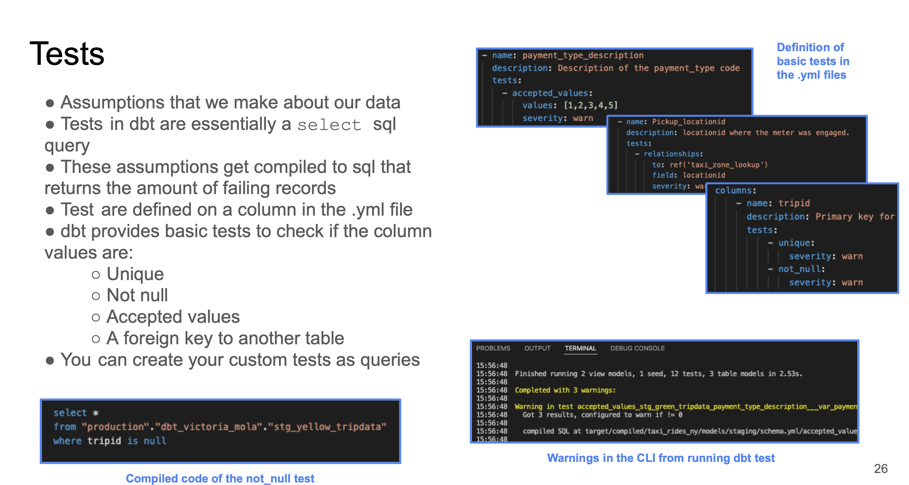
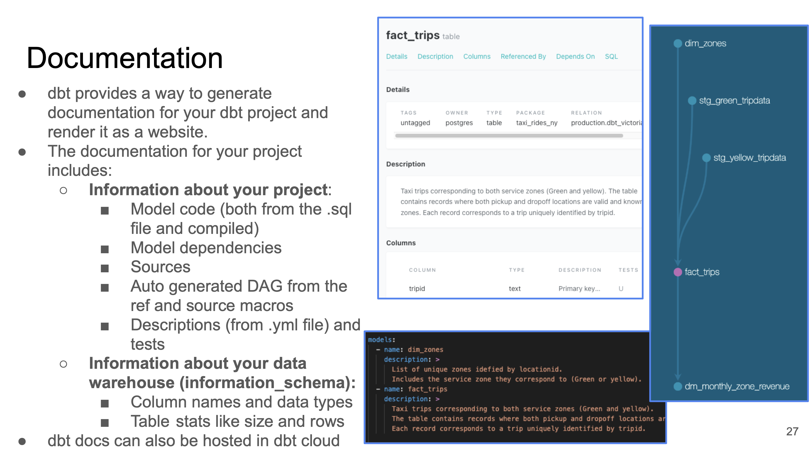

>[Back to Week Menu](README.md)
>
>Previous Theme: [Development of dbt models](dev_dbt_models.md)
>
>Next Theme: [Deployment of a dbt project](dbt_deployment.md)

## Testing and documenting dbt models

_[Video source](https://www.youtube.com/watch?v=UishFmq1hLM&list=PL3MmuxUbc_hJed7dXYoJw8DoCuVHhGEQb&index=37)_

Testing and documenting are not required steps to successfully run models, but they are expected in any professional setting.

### Testing
- Tests in dbt are ***assumptions*** that we make about our data.
- Tests in dbt are essentially a `SELECT` sql query
- Assumptions get compiled to sql that returns the amount of failing records
- Tests are defined on a column in the `.yml` file
- dbt provides basic tests to check if the column values are:
  - Unique
  - NOT NULL
  - Accepted values
  - A foreign key to another table
- You can create a custom tests as queries



Example:
```yaml
models:
  - name: stg_yellow_tripdata
    description: >
        Trips made by New York City's iconic yellow taxis. 
    columns:
        - name: tripid
        description: Primary key for this table, generated with a concatenation of vendorid+pickup_datetime
        tests:
            - unique:
                severity: warn
            - not_null:
                severrity: warn
```
* The tests are defined for a column in a specific table for a specific model.
* There are 2 tests in this YAML file: `unique` and `not_null`. Both are predefined by dbt.
* `unique` checks whether all the values in the `tripid` column are unique.
* `not_null` checks whether all the values in the `tripid` column are not null.
* Both tests will return a warning in the command line interface if they detect an error.

Here's what the `not_null` will compile to in SQL query form:

```sql
select *
from "my_project"."dbt_dev"."stg_yellow_tripdata"
```

You may run tests with the `dbt test` command.

_[Back to the top](#testing-and-documenting-dbt-models)_

### Documentation
- dbt also provides a way to generate documentation for your dbt project and render it as a website.
- The documentation for your project includes:
  - Information about the project:
    * Model code (both from the .sql files and compiled code)
    * Model dependencies
    * Sources
    * Auto generated DAGs from the `ref()` and `source()` macros
    * Descriptions from the `.yml files` and tests
  - Information about the Data Warehouse (`information_schema`):
    * Column names and data types
    * Table stats like size and rows
- dbt docs can also be hosted in dbt cloud



You may have noticed in the previous code block that a `description:` field can be added to the YAML field. dbt will make use of these fields to gather info.

dbt docs can be generated on the cloud or locally with `dbt docs generate`, and can be hosted in dbt Cloud as well or on any other webserver with `dbt docs serve`.

_[Back to the top](#testing-and-documenting-dbt-models)_

### Create and run tests and documentation: 

1. Create file `dm_monthly_zone_revenue.sql` in `core` folder:
  ```sql
  {{ config(materialized='table') }}
  
  with trips_data as (
      select * from {{ ref('fact_trips') }}
  )
      select 
      -- Reveneue grouping 
      pickup_zone as revenue_zone,
      -- for PostgreSQL
      -- date_trunc('month', pickup_datetime) as revenue_month, 
      -- for BQ
      date_trunc(pickup_datetime, month) as revenue_month, 
  
      service_type, 
  
      -- Revenue calculation 
      sum(fare_amount) as revenue_monthly_fare,
      sum(extra) as revenue_monthly_extra,
      sum(mta_tax) as revenue_monthly_mta_tax,
      sum(tip_amount) as revenue_monthly_tip_amount,
      sum(tolls_amount) as revenue_monthly_tolls_amount,
      sum(ehail_fee) as revenue_monthly_ehail_fee,
      sum(improvement_surcharge) as revenue_monthly_improvement_surcharge,
      sum(total_amount) as revenue_monthly_total_amount,
      sum(congestion_surcharge) as revenue_monthly_congestion_surcharge,
  
      -- Additional calculations
      count(tripid) as total_monthly_trips,
      avg(passenger_count) as avg_montly_passenger_count,
      avg(trip_distance) as avg_montly_trip_distance
  
      from trips_data
      group by 1,2,3
  ```
2. In file `models/staging/schema.yml` add section `models` with descriptions and tests for our models:
```
models:
    - name: stg_green_tripdata
      description: >
        Trip made by green taxis, also known as boro taxis and street-hail liveries.
        Green taxis may respond to street hails,but only in the areas indicated in green on the
        map (i.e. above W 110 St/E 96th St in Manhattan and in the boroughs).
        The records were collected and provided to the NYC Taxi and Limousine Commission (TLC) by
        technology service providers. 
      columns:
          - name: tripid
            description: Primary key for this table, generated with a concatenation of vendorid+pickup_datetime
            tests:
                - unique:
                    severity: warn
                - not_null:
                    severity: warn
....
```
3. Because we use var 'payment_type_values' in `schema.yml`
  ```
  - name: Payment_type 
              description: >
                A numeric code signifying how the passenger paid for the trip.
              tests: 
                - accepted_values:
                    values: "{{ var('payment_type_values') }}"
                    severity: warn
                    quote: false
  ```
  we need to add it to the `dbt_project.yml`:
  ```
  vars:
    payment_type_values: [1,2,3,4,5,6]
  ```
4. Run tests:
  ```
  dbt test
  ```
5. If we have warnings that fields are not unique, then we can modify our models to have only unique Primary Keys (or modify tests).
6. Build:
  ```
  dbt build
  ```
7. Create file `schema.yml` in folder `models/core/` with tests and documentation for other models ([schema.yml](taxi_rides_ny/models/core/schema.yml)).
8. Also, you can document `macros` and `seeds`.
9. Build:
  ```
  dbt build
  ```

_[Back to the top](#testing-and-documenting-dbt-models)_