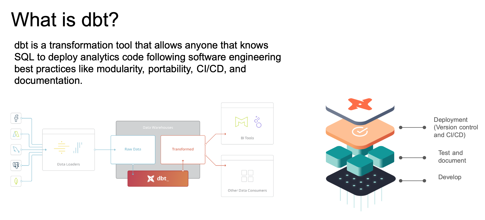
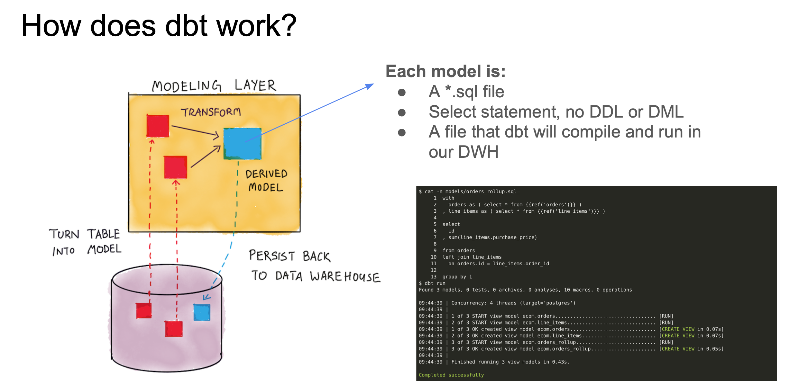
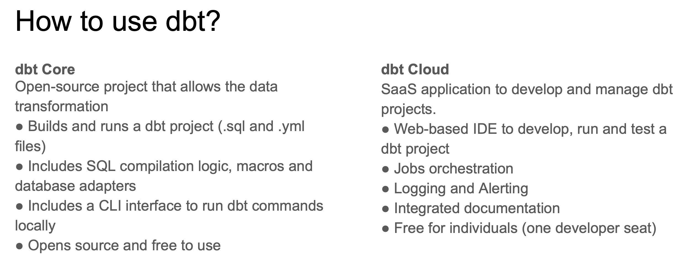
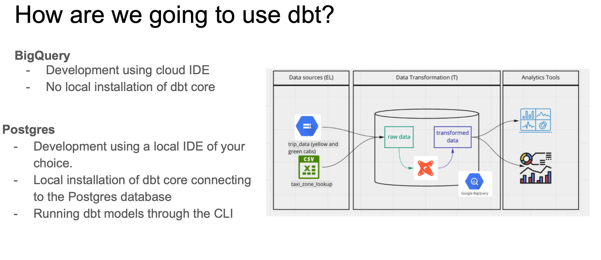

>[Back to Week Menu](README.md)
>
>Previous Theme: [Introduction to Analytics Engineering](intro_analytics_engineering.md)
>
>Next Theme: [Starting a dbt project: Project's goal & Preparation](goal_preparation.md)

## Introduction to dbt
_[Video source](https://www.youtube.com/watch?v=4eCouvVOJUw&list=PL3MmuxUbc_hJed7dXYoJw8DoCuVHhGEQb&index=35)_

### What is dbt?

***dbt*** stands for ***data build tool***. It's a _transformation_ tool: it allows us to transform process _raw_ data in our Data Warehouse to _transformed_ data which can be later used by Business Intelligence tools and any other data consumers.

dbt also allows us to introduce good software engineering practices by defining a _deployment workflow_:
1. Develop models
2. Test and document models
3. Deploy models with _version control_ and _CI/CD_.

_[Back to the top](#introduction-to-dbt)_

## How does dbt work?

dbt works by defining a ***modeling layer*** that sits on top of our Data Warehouse. The modeling layer will turn _tables_ into ***models*** which we will then transform into _derived models_, which can be then stored into the Data Warehouse for persistence.

A ***model*** is a .sql file with a `SELECT` statement; no DDL or DML is used. dbt will compile the file and run it in our Data Warehouse.

_[Back to the top](#introduction-to-dbt)_

## How to use dbt?

dbt has 2 main components: _dbt Core_ and _dbt Cloud_:
* ***dbt Core***: open-source project that allows the data transformation.
    * Builds and runs a dbt project (.sql and .yaml files).
    * Includes SQL compilation logic, macros and database adapters.
    * Includes a CLI interface to run dbt commands locally.
    * Open-source and free to use.
* ***dbt Cloud***: SaaS application to develop and manage dbt projects.
    * Web-based IDE to develop, run and test a dbt project.
    * Jobs orchestration.
    * Logging and alerting.
    * Intregrated documentation.
    * Free for individuals (one developer seat).

For integration with BigQuery we will use the dbt Cloud IDE, so a local installation of dbt core isn't required. For developing locally rather than using the Cloud IDE, dbt Core is required. Using dbt with a local Postgres database can be done with dbt Core, which can be installed locally and connected to Postgres and run models through the CLI.

_[Back to the top](#introduction-to-dbt)_