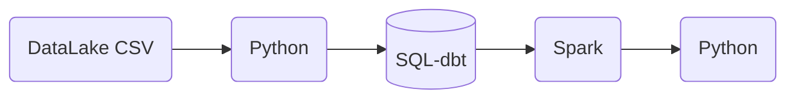

>[Back to Week Menu](README.md)
>
>Next Theme: [Introduction to Spark](intro_spark.md)

## Introduction to Batch Processing

_[Video source](https://youtu.be/dcHe5Fl3MF8?list=PL3MmuxUbc_hJed7dXYoJw8DoCuVHhGEQb)_


### Batch vs Streaming

There are 2 ways of processing data:
* ***Batch processing***: processing _chunks_ of data at _regular intervals_.
    * Example: processing taxi trips each month.
        ```mermaid
        graph LR;
            a[(taxi trips DB)]-->b(batch job)
            b-->a
        ```
* ***Streaming***: processing data _on the fly_.
    * Example: processing a taxi trip as soon as it's generated.
        ```mermaid
        graph LR;
            a{{User}}-. gets on taxi .->b{{taxi}}
            b-- ride start event -->c([data stream])
            c-->d(Processor)
            d-->e([data stream])
        ```

This lesson will cover ***batch processing***. Next lesson will cover streaming.

_[Back to the top](#introduction-to-batch-processing)_

### Types of batch jobs

A ***batch job*** is a ***job*** (a unit of work) that will process data in batches.

Batch jobs may be _scheduled_ in many ways:

* Weekly
* Daily (very common)
* Hourly (very common)
* X times per hour
* Every 5 minutes
* Etc...

Batch jobs may also be carried out using different technologies:

* Python scripts (like the [data pipelines in lesson 1](../week_1_basics_n_setup/README.md)).
    * Python scripts can be run anywhere (Kubernetes, AWS Batch, ...)
* SQL (like the [dbt models in lesson 4](../week_4_analytics_engineering/dev_dbt_models.md)).
* Spark (what we will use for this lesson)
* Flink
* Etc...

_[Back to the top](#introduction-to-batch-processing)_

### Orchestrating batch jobs

Batch jobs are commonly orchestrated with tools such as Airflow/Prefect.

A common workflow for batch jobs may be the following:



_[Back to the top](#introduction-to-batch-processing)_

### Pros and cons of batch jobs

* Advantages:
    * Easy to manage. There are multiple tools to manage them (the technologies we already mentioned)
    * Re-executable. Jobs can be easily retried if they fail.
    * Scalable. Scripts can be executed in more capable machines; Spark can be run in bigger clusters, etc.
* Disadvantages:
    * Delay. Each task of the workflow in the previous section may take a few minutes; assuming the whole workflow takes 20 minutes, we would need to wait those 20 minutes until the data is ready for work.

However, the advantages of batch jobs often compensate for its shortcomings, and as a result most companies that deal with data tend to work with batch jobs mos of the time (probably 90%).

_[Back to the top](#introduction-to-batch-processing)_