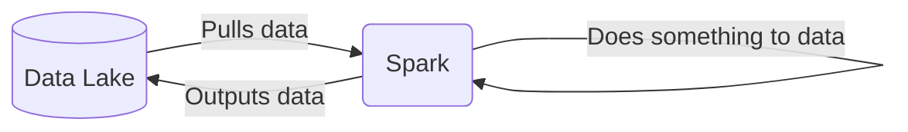
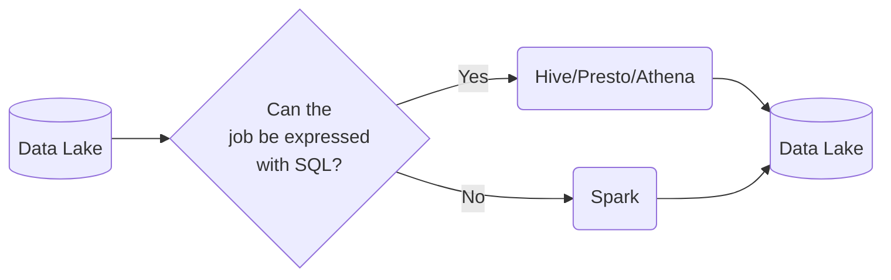
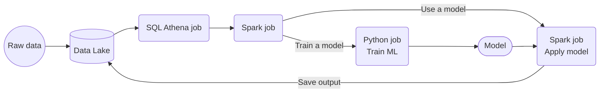

>[Back to Week Menu](README.md)
>
>Previous Theme: [Introduction to Batch Processing](intro_batch_processing.md)
>
>Next Theme: [Installing Spark](spark_install.md)

## Introduction to Spark
_[Video source](https://youtu.be/FhaqbEOuQ8U?list=PL3MmuxUbc_hJed7dXYoJw8DoCuVHhGEQb)_

### What is Spark?

[Apache Spark](https://spark.apache.org/) is an open-source ***multi-language*** unified analytics ***engine*** for large-scale data processing.

Spark is an ***engine*** because it _processes data_.

Spark can be run in _clusters_ with multiple _nodes_, each pulling and transforming data.

Spark is ***multi-language*** because we can use Java and Scala natively, and there are wrappers for Python, R and other languages.

The wrapper for Python is called [PySpark](https://spark.apache.org/docs/latest/api/python/).

Spark can deal with both batches and streaming data. The technique for streaming data is seeing a stream of data as a sequence of small batches and then applying similar techniques on them to those used on regular batches. We will cover streaming in detail in the next lesson.

_[Back to the top](#introduction-to-spark)_

### Why do we need Spark?

Spark is used for transforming data in a Data Lake.

There are tools such as Hive, Presto or Athena (a AWS managed Presto) that allow you to express jobs as SQL queries. However, there are times where you need to apply more complex manipulation which are very difficult or even impossible to express with SQL (such as ML models); in those instances, Spark is the tool to use.

A typical workflow may combine both tools. Here's an example of a workflow involving Machine Learning:

In this scenario, most of the preprocessing would be happening in Athena, so for everything that can be expressed with SQL, it's always a good idea to do so, but for everything else, there's Spark.

_[Back to the top](#introduction-to-spark)_