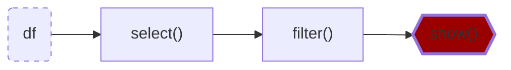

>[Back to Week Menu](README.md)
>
>Previous Theme: [First Look at Spark/PySpark](spark_first_look.md)
>
>Next Theme: 

## Spark Dataframes
_[Video source](https://youtu.be/ti3aC1m3rE8?list=PL3MmuxUbc_hJed7dXYoJw8DoCuVHhGEQb)_

[As we said before](spark_first_look.md#reading-csv-files), Spark works with ***dataframes***.

We can create a dataframe from the parquet files we created in the previous section:

```python
df = spark.read.parquet('fhvhv/2021/01/')
```

Unlike CSV files, parquet files contain the schema of the dataset, so there is no need to specify a schema like we previously did when reading the CSV file. You can check the schema like this:

```python
df.printSchema()
```

(One of the reasons why parquet files are smaller than CSV files is because they store the data according to the datatypes, so integer values will take less space than long or string values.)

There are many Pandas-like operations that we can do on Spark dataframes, such as:
* Column selection - returns a dataframe with only the specified columns.
    ```python
    new_df = df.select('pickup_datetime', 'dropoff_datetime', 'PULocationID', 'DOLocationID')
    ```
* Filtering by value - returns a dataframe whose records match the condition stated in the filter.
    ```python
    new_df = df.select('pickup_datetime', 'dropoff_datetime', 'PULocationID', 'DOLocationID').filter(df.hvfhs_license_num == 'HV0003')
    ```
* And many more. The official Spark documentation website contains a [quick guide for dataframes](https://spark.apache.org/docs/latest/api/python/getting_started/quickstart_df.html).

_[Back to the top](#)_

## Actions vs Transformations

_[Video source](https://www.youtube.com/watch?v=ti3aC1m3rE8&list=PL3MmuxUbc_hJed7dXYoJw8DoCuVHhGEQb&index=51)_

Some Spark methods are "lazy", meaning that they are not executed right away. You can test this with the last instructions we run in the previous section: after running them, the Spark UI will not show any new jobs. However, running `df.show()` right after will execute right away and display the contents of the dataframe; the Spark UI will also show a new job.

These lazy commands are called ***transformations*** and the eager commands are called ***actions***. Computations only happen when actions are triggered.
```python
df.select(...).filter(...).show()
```

Both `select()` and `filter()` are _transformations_, but `show()` is an _action_. The whole instruction gets evaluated only when the `show()` action is triggered.

List of transformations (lazy):
* Selecting columns
* Filtering
* Joins
* Group by
* Partitions
* ...

List of actions (eager):
* Show, take, head
* Write, read
* ...

_[Back to the top](#)_

## Functions and User Defined Functions (UDFs)

_[Video source](https://www.youtube.com/watch?v=ti3aC1m3rE8&list=PL3MmuxUbc_hJed7dXYoJw8DoCuVHhGEQb&index=51)_

Besides the SQL and Pandas-like commands we've seen so far, Spark provides additional built-in functions that allow for more complex data manipulation. By convention, these functions are imported as follows:

```python
from pyspark.sql import functions as F
```

Here's an example of built-in function usage:
```python
df \
    .withColumn('pickup_date', F.to_date(df.pickup_datetime)) \
    .withColumn('dropoff_date', F.to_date(df.dropoff_datetime)) \
    .select('pickup_date', 'dropoff_date', 'PULocationID', 'DOLocationID') \
    .show()
```
* `withColumn()` is a ***transformation*** that adds a new column to the dataframe.
    * ***IMPORTANT***: adding a new column with the same name as a previously existing column will overwrite the existing column!
* `select()` is another transformation that selects the stated columns.
* `F.to_date()` is a built-in Spark function that converts a timestamp to date format (year, month and day only, no hour and minute).

A list of built-in functions is available [in the official Spark documentation page](https://spark.apache.org/docs/latest/api/sql/index.html).

Besides these built-in functions, Spark allows us to create ***User Defined Functions*** (UDFs) with custom behavior for those instances where creating SQL queries for that behaviour becomes difficult both to manage and test.

UDFs are regular functions which are then passed as parameters to a special builder. Let's create one:

```python
# A crazy function that changes values when they're divisible by 7 or 3
def crazy_stuff(base_num):
    num = int(base_num[1:])
    if num % 7 == 0:
        return f's/{num:03x}'
    elif num % 3 == 0:
        return f'a/{num:03x}'
    else:
        return f'e/{num:03x}'

# Creating the actual UDF
crazy_stuff_udf = F.udf(crazy_stuff, returnType=types.StringType())
```
* `F.udf()` takes a function (`crazy_stuff()` in this example) as parameter as well as a return type for the function (a string in our example).
* While `crazy_stuff()` is obviously non-sensical, UDFs are handy for things such as ML and other complex operations for which SQL isn't suitable or desirable. Python code is also easier to test than SQL.

We can then use our UDF in transformations just like built-in functions:

```python
df \
    .withColumn('pickup_date', F.to_date(df.pickup_datetime)) \
    .withColumn('dropoff_date', F.to_date(df.dropoff_datetime)) \
    .withColumn('base_id', crazy_stuff_udf(df.dispatching_base_num)) \
    .select('base_id', 'pickup_date', 'dropoff_date', 'PULocationID', 'DOLocationID') \
    .show()
```

_[Back to the top](#spark-dataframes)_