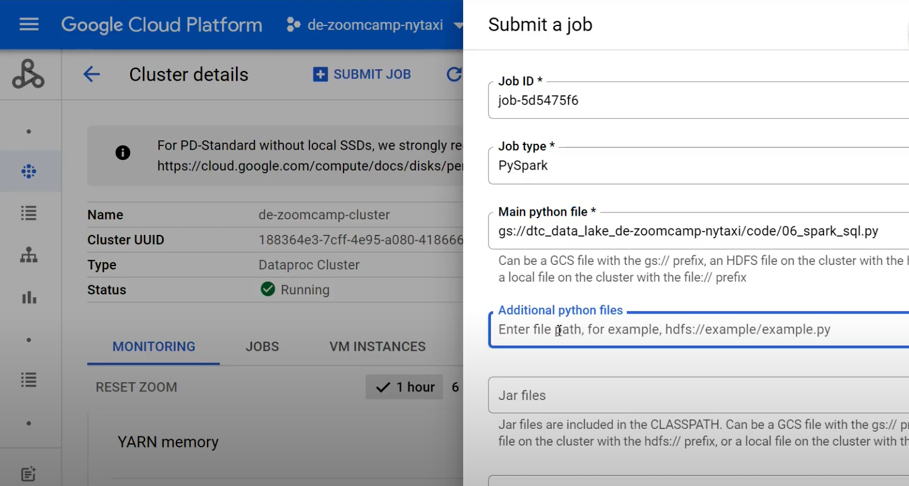
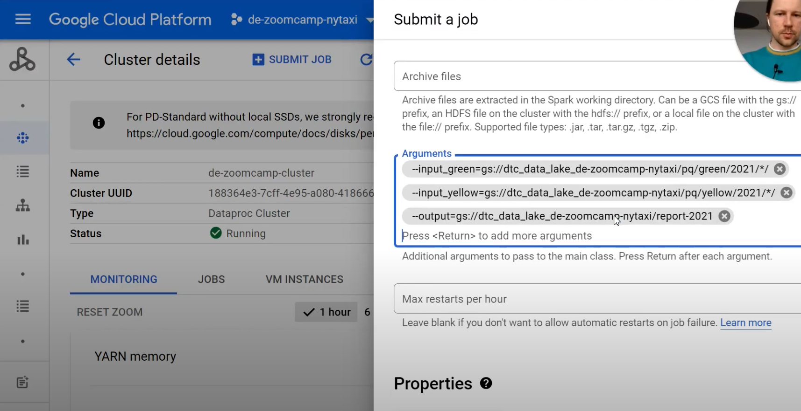

>[Back to Week Menu](README.md)
>
>Previous Theme: [Resilient Distributed Datasets](rdd.md)
>
> [Homework](../cohorts/2023/week_4_analytics_engineering/homework.md)

# Running Spark in the Cloud
_Video sources: [1](https://youtu.be/Yyz293hBVcQ&list=PL3MmuxUbc_hJed7dXYoJw8DoCuVHhGEQb), [2](https://youtu.be/HXBwSlXo5IA&list=PL3MmuxUbc_hJed7dXYoJw8DoCuVHhGEQ), [3](https://youtu.be/osAiAYahvh8&list=PL3MmuxUbc_hJed7dXYoJw8DoCuVHhGEQb), [4](https://youtu.be/HIm2BOj8C0Q&list=PL3MmuxUbc_hJed7dXYoJw8DoCuVHhGEQb)_

_[Commands](code/cloud.md)_

So far we've seen how to run Spark locally and how to work with local data. In this section we will cover how to use Spark with remote data and run Spark in the cloud as well.

## Connecting to Google Cloud Storage

_[Video source](https://youtu.be/Yyz293hBVcQ&list=PL3MmuxUbc_hJed7dXYoJw8DoCuVHhGEQb)_

Google Cloud Storage is an _object store_, which means that it doesn't offer a fully featured file system. Spark can connect to remote object stores by using ***connectors***; each object store has its own connector, so we will need to use [Google's Cloud Storage Connector](https://cloud.google.com/dataproc/docs/concepts/connectors/cloud-storage) if we want our local Spark instance to connect to our Data Lake.

Before we do that, we will use `gsutil` to upload our local files to our Data Lake. `gsutil` is included with the GCP SDK, so you should already have it if you've followed the previous chapters.

### Uploading files to Cloud Storage with `gsutil`

Assuming you've got a bunch of parquet files you'd like to upload to Cloud Storage, run the following command to upload them:

```bash
# gsutil -m cp -r <local_folder> gs://<bucket_name/destination_folder>
gsutil -m cp -r pq/ gs://dtc_data_lake_substantial-mix-378619/pq
```
* The `-m` option is for enabling multithreaded upload in order to speed it up.
* `cp` is for copying files.
* `-r` stands for _recursive_; it's used to state that the contents of the local folder are to be uploaded. For single files this option isn't needed.

### Configuring Spark with the GCS connector

Go to the [Google's Cloud Storage Connector page](https://cloud.google.com/dataproc/docs/concepts/connectors/cloud-storage) and download the corresponding version of the connector. The version tested for this lesson is version 2.5.5 for Hadoop 3; create a `lib` folder in your work directory and run the following command from it:

```bash
gsutil cp gs://hadoop-lib/gcs/gcs-connector-hadoop3-2.2.5.jar gcs-connector-hadoop3-2.2.5.jar
```

This will download the connector to the local folder.

We now need to follow a few extra steps before creating the Spark session in our notebook. Import the following libraries:

```python
import pyspark
from pyspark.sql import SparkSession
from pyspark.conf import SparkConf
from pyspark.context import SparkContext
```

Now we need to configure Spark by creating a configuration object. Run the following code to create it:

```python
# credentials_location = '~/.google/credentials/google_credentials.json'
credentials_location = '/home/albert_tests/.gc/substantial-mix-378619-60967f2514fa.json'

conf = SparkConf() \
    .setMaster('local[*]') \
    .setAppName('test') \
    .set("spark.jars", "./lib/gcs-connector-hadoop3-2.2.5.jar") \
    .set("spark.hadoop.google.cloud.auth.service.account.enable", "true") \
    .set("spark.hadoop.google.cloud.auth.service.account.json.keyfile", credentials_location)
```

You may have noticed that we're including a couple of options that we previously used when creating a Spark Session with its builder. That's because we implicitly created a ***context***, which represents a connection to a spark cluster. This time we need to explicitly create and configure the context like so:

```python
sc = SparkContext(conf=conf)

hadoop_conf = sc._jsc.hadoopConfiguration()

hadoop_conf.set("fs.AbstractFileSystem.gs.impl",  "com.google.cloud.hadoop.fs.gcs.GoogleHadoopFS")
hadoop_conf.set("fs.gs.impl", "com.google.cloud.hadoop.fs.gcs.GoogleHadoopFileSystem")
hadoop_conf.set("fs.gs.auth.service.account.json.keyfile", credentials_location)
hadoop_conf.set("fs.gs.auth.service.account.enable", "true")
```

This will likely output a warning when running the code. You may ignore it.

We can now finally instantiate a Spark session:

```python
spark = SparkSession.builder \
    .config(conf=sc.getConf()) \
    .getOrCreate()
```

### Reading the remote data

In order to read the parquet files stored in the Data Lake, you simply use the bucket URI as a parameter, like so:

```python
# df_green = spark.read.parquet('gs://dtc_data_lake_de-zoomcamp-nytaxi/pq/green/*/*')
df_green = spark.read.parquet('gs://dtc_data_lake_substantial-mix-378619/pq/green/*/*')
```

You should obviously change the URI in this example for yours.

You may now work with the `df_green` dataframe normally:
```python
df_green.show()
df_green.count()
```
 
_[Back to the top](#running-spark-in-the-cloud)_

## Creating a Local Spark Cluster

_[Video source](https://www.youtube.com/watch?v=HXBwSlXo5IA&list=PL3MmuxUbc_hJed7dXYoJw8DoCuVHhGEQb&index=62)_

### Spark standalone master and workers

[At the beginning of this lesson](spark_first_look.md#creating-a-spark-session) we saw how to create a Spark session from a notebook, like so:

```python
spark = SparkSession.builder \
    .master("local[*]") \
    .appName('test') \
    .getOrCreate()
```

This code will start a local cluster, but once the notebook kernel is shut down, the cluster will disappear.

We will now see how to create a Spark cluster in [Standalone Mode](https://spark.apache.org/docs/latest/spark-standalone.html) so that the cluster can remain running even after we stop running our notebooks.

Simply go to your Spark install directory from a terminal (`cd $SPARK_HOME`) and run Spark master:

```bash
./sbin/start-master.sh
```

You should now be able to open the main Spark dashboard by browsing to `localhost:8080` (remember to forward the port if you're running it on a virtual machine). At the very top of the dashboard the URL for the dashboard should appear; copy it and use it in your session code like so:

```python
spark = SparkSession.builder \
    .master("spark://<URL>:7077") \
    .appName('test') \
    .getOrCreate()
```
* Note that we used the HTTP port 8080 for browsing to the dashboard but we use the Spark port 7077 for connecting our code to the cluster.
* Using `localhost` as a stand-in for the URL may not work.

You may note that in the Spark dashboard there aren't any _workers_ listed. The actual Spark jobs are run from within ***workers*** (or _slaves_ in older Spark versions), which we need to create and set up.

Similarly to how we created the Spark master, we can run a worker from the command line by running the following command from the Spark install directory:

```bash
./sbin/start-worker.sh <master-spark-URL>
```
* In older Spark versions, the script to run is `start-slave.sh` .

Once you've run the command, you should see a worker in the Spark dashboard.

Note that a worker may not be able to run multiple jobs simultaneously. If you're running separate notebooks and connecting to the same Spark worker, you can check in the Spark dashboard how many Running Applications exist. Since we haven't configured the workers, any jobs will take as many resources as there are available for the job.

### Parametrizing our scripts for Spark

So far we've hard-coded many of the values such as folders and dates in our code, but with a little bit of tweaking we can make our code so that it can receive parameters from Spark and make our code much more reusable and versatile.

1. Convert a notebook to a script with `nbconvert` (`jupyter nbconvert --to=script 06_spark_sql_modify.ipynb`), manually modify it or create it from scratch:

    ```python
    # 06_spark_sql.py
    #!/usr/bin/env python
    # coding: utf-8
    
    import pyspark
    from pyspark.sql import SparkSession
    from pyspark.sql import functions as F
    
    spark = SparkSession.builder \
        .master("spark://de-zoomcamp.us-east1-b.c.substantial-mix-378619.internal:7077") \
        .appName('test') \
        .getOrCreate()
    
    df_green = spark.read.parquet('data/pq/green/*/*')
    
    df_green = df_green \
        .withColumnRenamed('lpep_pickup_datetime', 'pickup_datetime') \
        .withColumnRenamed('lpep_dropoff_datetime', 'dropoff_datetime')
    
    df_yellow = spark.read.parquet('data/pq/yellow/*/*')
    
    df_yellow = df_yellow \
        .withColumnRenamed('tpep_pickup_datetime', 'pickup_datetime') \
        .withColumnRenamed('tpep_dropoff_datetime', 'dropoff_datetime')
    
    common_colums = [
         'VendorID',
         'pickup_datetime',
         'dropoff_datetime',
         'store_and_fwd_flag',
         'RatecodeID',
         'PULocationID',
         'DOLocationID',
         'passenger_count',
         'trip_distance',
         'fare_amount',
         'extra',
         'mta_tax',
         'tip_amount',
         'tolls_amount',
         'improvement_surcharge',
         'total_amount',
         'payment_type',
         'congestion_surcharge'
    ]
    
    df_green_sel = df_green \
        .select(common_colums) \
        .withColumn('service_type', F.lit('green'))
    
    df_yellow_sel = df_yellow \
        .select(common_colums) \
        .withColumn('service_type', F.lit('yellow'))
    
    df_trips_data = df_green_sel.unionAll(df_yellow_sel)
    
    df_trips_data.registerTempTable('trips_data')
    
    df_result = spark.sql("""
    SELECT 
        -- Reveneue grouping 
        PULocationID AS revenue_zone,
        date_trunc('month', pickup_datetime) AS revenue_month, 
        service_type, 
    
        -- Revenue calculation 
        SUM(fare_amount) AS revenue_monthly_fare,
        SUM(extra) AS revenue_monthly_extra,
        SUM(mta_tax) AS revenue_monthly_mta_tax,
        SUM(tip_amount) AS revenue_monthly_tip_amount,
        SUM(tolls_amount) AS revenue_monthly_tolls_amount,
        SUM(improvement_surcharge) AS revenue_monthly_improvement_surcharge,
        SUM(total_amount) AS revenue_monthly_total_amount,
        SUM(congestion_surcharge) AS revenue_monthly_congestion_surcharge,
    
        -- Additional calculations
        AVG(passenger_count) AS avg_montly_passenger_count,
        AVG(trip_distance) AS avg_montly_trip_distance
    FROM
        trips_data
    GROUP BY
        1, 2, 3
    """)
    
    df_result.coalesce(1). \
         write.parquet('data/report/revenue/', mode='overwrite')
    ```

2. Run it:
    ```python
    $ python 06_spark_sql.py
    ```
3. Check folder `/code/data/report/revenue/` for new created *.parquet file.
4. We will use the [argparse library](https://docs.python.org/3/library/argparse.html) for parsing parameters. Add to the script the following:
    ```python
    import argparse
    
    import pyspark
    from pyspark.sql import SparkSession
    from pyspark.sql import functions as F
    
    parser.add_argument('--input_green', required=True)
    parser.add_argument('--input_yellow', required=True)
    parser.add_argument('--output', required=True)
    
    input_green = args.input_green
    input_yellow = args.input_yellow
    output = args.output
    ```

5. We can now modify previous lines using the 3 parameters we've created. For example:
   ```python
   df_green = spark.read.parquet(input_green)
   ```

6. Once we've finished our script, we simply call it from a terminal line with the parameters we need:
   ```bash
   python 06_spark_sql.py \
       --input_green=data/pq/green/2020/*/ \
       --input_yellow=data/pq/yellow/2020/*/ \
       --output=data/report-2020
   ```

### Submitting Spark jobs with Spark submit

However, we still haven't covered any Spark specific parameters; things like the cluster URL when having multiple available clusters or how many workers to use for the job. Instead of specifying these parameters when setting up the session inside the script, we can use an external script called [Spark submit](https://spark.apache.org/docs/latest/submitting-applications.html). It's used for submitting spark jobs to spark clusters.

1. Remove master-configuration from script:
   ```python
   spark = SparkSession.builder \
       .appName('test') \
       .getOrCreate()
   ```
2. Specify master outside using `spark-submit`:
   ```bash
   URL="spark://de-zoomcamp.us-east1-b.c.substantial-mix-378619.internal:7077"
   spark-submit \
       --master="${URL}" \
       06_spark_sql.py \
           --input_green=data/pq/green/2021/*/ \
           --input_yellow=data/pq/yellow/2021/*/ \
           --output=data/report-2021
   ```

   You may find more sophisticated uses of `spark-submit` in the [official documentation](https://spark.apache.org/docs/latest/submitting-applications.html).

   > You may download a finished script [from this link](code/06_spark_sql.py)

3. After you're done running Spark in standalone mode, you will need to manually shut it down. Simply run the:
   - `./sbin/stop-worker.sh` (`./sbin/stop-slave.sh` in older Spark versions) and
   - `./sbin/stop-master.sh` scripts to shut down Spark.

_[Back to the top](#running-spark-in-the-cloud)_

## Setting up a Dataproc Cluster

### Creating the cluster

_[Video source](https://www.youtube.com/watch?v=osAiAYahvh8&list=PL3MmuxUbc_hJed7dXYoJw8DoCuVHhGEQb&index=61)_

[Dataproc](https://cloud.google.com/dataproc) is Google's cloud-managed service for running Spark and other data processing tools such as Flink, Presto, etc.

You may access Dataproc from the GCP dashboard and typing `dataproc` on the search bar. The first time you access it you will have to enable the API.

In the images below you may find some example values for creating a simple cluster. Give it a name of your choosing and choose the same region as your bucket.


We would normally choose a `standard` cluster, but you may choose `single node` if you just want to experiment and not run any jobs.


Optionally, you may install additional components but we won't be covering them in this lesson.


You may leave all other optional settings with their default values. After you click on `Create`, it will take a few seconds to create the cluster. You may notice an extra VM instance under VMs; that's the Spark instance.

### Running a job with the web UI

In a [previous section](#configuring-spark-with-the-gcs-connector) we saw how to connect Spark to our bucket in GCP. However, in Dataproc we don't need to specify this connection because it's already pre-configured for us. We will also submit jobs using a menu, following similar principles to what we saw in the previous section.

In Dataproc's _Clusters_ page, choose your cluster and un the _Cluster details_ page, click on `Submit job`. Under _Job type_ choose `PySpark`, then in _Main Python file_ write the path to your script (you may upload the script to your bucket and then copy the URL).
```
$ gsutil cp week_5_batch_processing/code/06_spark_sql.py gs://dtc_data_lake_substantial-mix-378619/code/06_spark_sql.py
```



Make sure that your script does not specify the `master` cluster! Your script should take the connection details from Dataproc; make sure it looks something like this:

```python
spark = SparkSession.builder \
    .appName('test') \
    .getOrCreate()
```

You may use [this script](code/06_spark_sql.py) for testing.

We also need to specify arguments, in a similar fashion to what we saw [in the previous section](#parametrizing-our-scripts-for-spark), but using the URL's for our folders rather than the local paths:
```
--input_green=gs://dtc_data_lake_substantial-mix-378619/pq/green/2021/*/
--input_yellow=gs://dtc_data_lake_substantial-mix-378619/pq/yellow/2021/*/
--output=gs://dtc_data_lake_substantial-mix-378619/report-2021
```



Now press `Submit`. Sadly there is no easy way to access the Spark dashboard but you can check the status of the job from the `Job details` page.

### Running a job with the gcloud SDK

Besides the web UI, there are additional ways to run a job, listed [in this link](https://cloud.google.com/dataproc/docs/guides/submit-job). We will focus on the gcloud SDK now.

- Before you can submit jobs with the SDK, you will need to grant permissions to the Service Account we've been using so far. Go to _IAM & Admin_ and edit your Service Account so that the `Dataproc Administrator` role is added to it. (The best practice is to have separate Service Accounts with separate roles for different purposes: Terraform, Prefect(Airflow) workers, Dataproc, etc.)

- We can now submit a job from the command line, like this:
   ```bash
   gcloud dataproc jobs submit pyspark \
       --cluster=de-zoomcamp-cluster \
       --region=us-east1 \
       gs://dtc_data_lake_substantial-mix-378619/code/06_spark_sql.py \
       -- \
           --input_green=gs://dtc_data_lake_substantial-mix-378619/pq/green/2020/*/ \
           --input_yellow=gs://dtc_data_lake_substantial-mix-378619/pq/yellow/2020/*/ \
           --output=gs://dtc_data_lake_substantial-mix-378619/report-2020
   ```

You may find more details on how to run jobs [in the official docs](https://cloud.google.com/dataproc/docs/guides/submit-job).

_[Back to the top](#running-spark-in-the-cloud)_

## Connecting Spark to BigQuery

_[Commands](code/cloud.md)_

Write results to big query ([docs](https://cloud.google.com/dataproc/docs/tutorials/bigquery-connector-spark-example#pyspark))

1. Copy `06_spark_sql.py` to `06_spark_sql_big_query.py`.
2. Change saving DataFrame from parquet files to BigQuery:
   ```
   # Saving the data to BigQuery
   df_result.write.format('bigquery') \
       .option('table', output) \
       .save()
   ```
3. Add to script to use the Cloud Storage bucket for temporary BigQuery export data used by the connector. When Dataproc was created the temp bucket was created. We use it:
   ```python
   spark.conf.set('temporaryGcsBucket', 'dataproc-temp-us-east1-1092502114651-vyi6r0sc')
   ```
4. Upload python script to Google Cloud Storage:
   ```
   $ gsutil cp 06_spark_sql_big_query.py gs://dtc_data_lake_substantial-mix-378619/code/06_spark_sql_big_query.py
   ```
5. Submit Dataproc job:
   ```bash
   gcloud dataproc jobs submit pyspark \
       --cluster=de-zoomcamp-cluster \
       --region=us-east1 \
       --jars=gs://spark-lib/bigquery/spark-bigquery-latest_2.12.jar \
       gs://dtc_data_lake_substantial-mix-378619/code/06_spark_sql_big_query.py \
       -- \
           --input_green=gs://dtc_data_lake_substantial-mix-378619/pq/green/2020/*/ \
           --input_yellow=gs://dtc_data_lake_substantial-mix-378619/pq/yellow/2020/*/ \
           --output=trips_data_all.reports-2020
   ```
6. Then Spark creates a table `trips_data_all.reports-2020` in Big Query and put information there. 

_[Back to the top](#running-spark-in-the-cloud)_