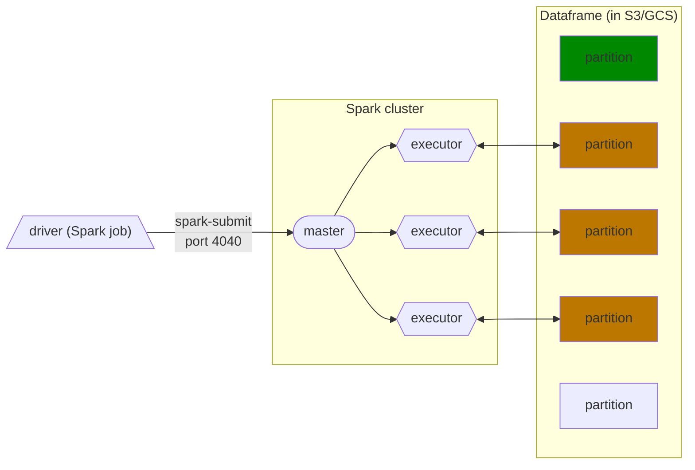
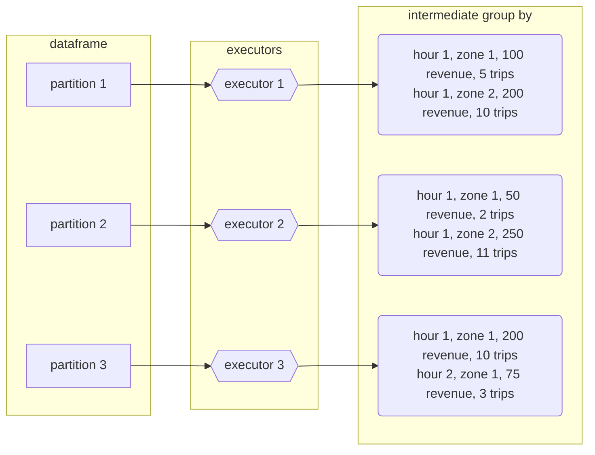
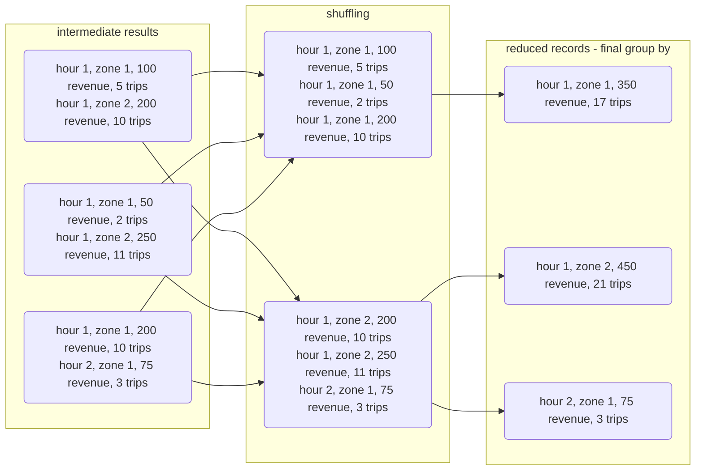
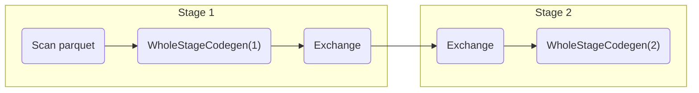
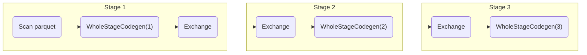
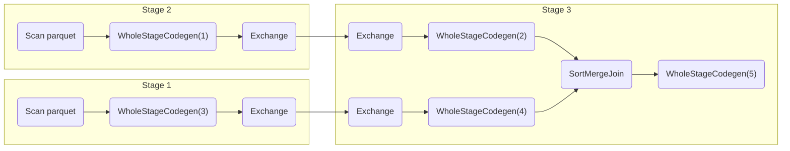
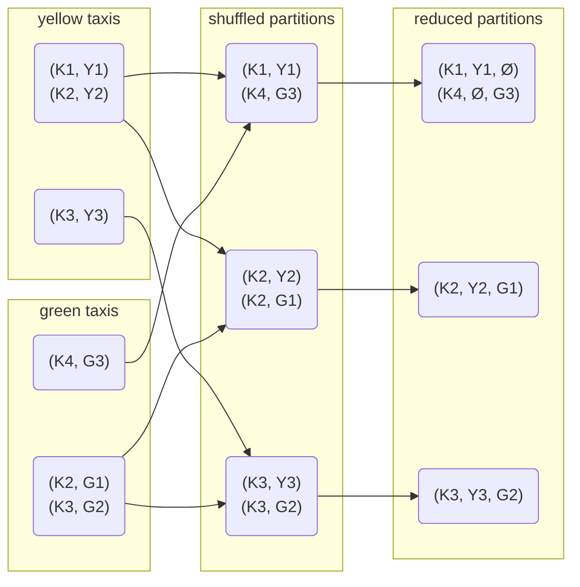
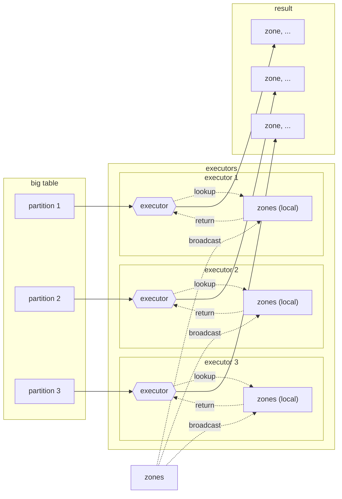

>[Back to Week Menu](README.md)
>
>Previous Theme: [SQL with Spark](spark_sql.md)
>
>Next Theme: [Resilient Distributed Datasets](rdd.md)

## Spark Internals
_Video sources: [1](https://youtu.be/68CipcZt7ZA&list=PL3MmuxUbc_hJed7dXYoJw8DoCuVHhGEQb), [2](https://youtu.be/9qrDsY_2COo&list=PL3MmuxUbc_hJed7dXYoJw8DoCuVHhGEQb), [3](https://youtu.be/lu7TrqAWuH4&list=PL3MmuxUbc_hJed7dXYoJw8DoCuVHhGEQb)_


### Spark Cluster

_[Video source](https://youtu.be/68CipcZt7ZA&list=PL3MmuxUbc_hJed7dXYoJw8DoCuVHhGEQb)_

Until now, we've used a ***local cluster*** to run our Spark code, but Spark clusters often contain multiple computers that behave as executors.

Spark clusters are managed by a ***master***, which behaves similarly to an entry point of a Kubernetes cluster. A ***driver*** (an Airflow DAG, a computer running a local script, etc.) that wants to execute a Spark job will send the job to the master, which in turn will divide the work among the cluster's executors. If any executor fails and becomes offline for any reason, the master will reassign the task to another executor.



Each executor will fetch a ***dataframe partition*** stored in a ***Data Lake*** (usually S3, GCS or a similar cloud provider), do something with it and then store it somewhere, which could be the same Data Lake or somewhere else. If there are more partitions than executors, executors will keep fetching partitions until every single one has been processed.

This is in contrast to [Hadoop](https://hadoop.apache.org/), another data analytics engine, whose executors locally store the data they process. Partitions in Hadoop are duplicated across several executors for redundancy, in case an executor fails for whatever reason (Hadoop is meant for clusters made of commodity hardware computers). However, data locality has become less important as storage and data transfer costs have dramatically decreased and nowadays it's feasible to separate storage from computation, so Hadoop has fallen out of fashion.

_[Back to the top](#spark-internals)_

### GROUP BY in Spark

_[Video source](https://www.youtube.com/watch?v=9qrDsY_2COo&list=PL3MmuxUbc_hJed7dXYoJw8DoCuVHhGEQb&index=55)_

#### Preparation in Jupyter Notebook:
```python
import pyspark
from pyspark.sql import SparkSession

spark = SparkSession.builder \
    .master("local[*]") \
    .appName('test') \
    .getOrCreate()

df_green = spark.read.parquet('data/pq/green/*/*')

df_green.registerTempTable('green')
```

#### GROUP BY query

Let's do the following query:

```python
df_green_revenue = spark.sql("""
SELECT 
    date_trunc('hour', lpep_pickup_datetime) AS hour, 
    PULocationID AS zone,

    SUM(total_amount) AS amount,
    COUNT(1) AS number_records
FROM
    green
WHERE
    lpep_pickup_datetime >= '2020-01-01 00:00:00'
GROUP BY
    1, 2  
""")
```

#### Save:
```python
df_green_revenue.write.parquet('data/report/revenue/green', mode='overwrite')
```

This query will output the total revenue and amount of trips per hour per zone. We need to group by hour and zones in order to do this.

Since the data is split along partitions, it's likely that we will need to group data which is in separate partitions, but executors only deal with individual partitions. Spark solves this issue by separating the grouping in 2 stages:

1. In the first stage, each executor groups the results in the partition they're working on and outputs the results to a temporary partition. These temporary partitions are the ***intermediate results***.



2. The second stage ***shuffles*** the data: Spark will put all records with the ***same keys*** (in this case, the `GROUP BY` keys which are hour and zone) in the ***same partition***. The algorithm to do this is called _external merge sort_. Once the shuffling has finished, we can once again apply the `GROUP BY` to these new partitions and ***reduce*** the records to the ***final output***.
    * Note that the shuffled partitions may contain more than one key, but all records belonging to a key should end up in the same partition.



Running the query should display the following DAG in the Spark UI:


* The `Exchange` task refers to the shuffling.

If we were to add sorting to the query (adding a `ORDER BY 1,2` at the end), Spark would perform a very similar operation to `GROUP BY` after grouping the data. The resulting DAG would look liked this:



#### The same for the yellow data:
```python
df_yellow = spark.read.parquet('data/pq/yellow/*/*')
df_yellow.registerTempTable('yellow')

df_yellow_revenue = spark.sql("""
SELECT 
    date_trunc('hour', tpep_pickup_datetime) AS hour, 
    PULocationID AS zone,

    SUM(total_amount) AS amount,
    COUNT(*) AS number_records
FROM
    yellow
WHERE
    tpep_pickup_datetime >= '2020-01-01 00:00:00'
GROUP BY
    1, 2 
""")

df_yellow_revenue.write.parquet('data/report/revenue/yellow', mode='overwrite')
```

By default, Spark will repartition the dataframe to 200 partitions (but I had only 4) after shuffling data. For the kind of data we're dealing with in this example this could be counterproductive because of the small size of each partition/file, but for larger datasets this is fine.

Shuffling is an ***expensive operation***, so it's in our best interest to reduce the amount of data to shuffle when querying.
* Keep in mind that repartitioning also involves shuffling data.

#### Repartition green and yellow data to have 20 partitions:
```python
df_green_revenue \
    .repartition(20) \
    .write.parquet('data/report/revenue/green', mode='overwrite')

df_yellow_revenue \
    .repartition(20) \
    .write.parquet('data/report/revenue/yellow', mode='overwrite')
```

_[Back to the top](#spark-internals)_

## Joins in Spark

_[Video source](https://www.youtube.com/watch?v=lu7TrqAWuH4&list=PL3MmuxUbc_hJed7dXYoJw8DoCuVHhGEQb&index=56)_

Joining tables in Spark is implemented in a similar way to `GROUP BY` and `ORDER BY`, but there are 2 distinct cases: joining 2 large tables and joining a large table and a small table.

### Joining 2 large tables

Let's assume that we've created a `df_yellow_revenue` dataframe in the same manner as the `df_green_revenue` we created in the previous section. We want to join both tables, so we will create temporary dataframes with changed column names so that we can tell apart data from each original table:

```python
df_green_revenue_tmp = df_green_revenue \
    .withColumnRenamed('amount', 'green_amount') \
    .withColumnRenamed('number_records', 'green_number_records')

df_yellow_revenue_tmp = df_yellow_revenue \
    .withColumnRenamed('amount', 'yellow_amount') \
    .withColumnRenamed('number_records', 'yellow_number_records')
```
* Both of these queries are _transformations_; Spark doesn't actually do anything when we run them.

We will now perform an [outer join](https://dataschool.com/how-to-teach-people-sql/sql-join-types-explained-visually/) so that we can display the amount of trips and revenue per hour per zone for green and yellow taxis at the same time regardless of whether the hour/zone combo had one type of taxi trips or the other:

```python
df_join = df_green_revenue_tmp.join(df_yellow_revenue_tmp, on=['hour', 'zone'], how='outer')
```
* `on=` receives a list of columns by which we will join the tables. This will result in a ***primary composite key*** for the resulting table.
* `how=` specifies the type of `JOIN` to execute.

#### Save:
```python
df_join.write.parquet('data/report/revenue/total')
```

When we run either `show()` or `write()` on this query, Spark will have to create both the temporary dataframes and the joint final dataframe. The DAG will look like this:



Stages 1 and 2 belong to the creation of `df_green_revenue_tmp` and `df_yellow_revenue_tmp`.

For stage 3, given all records for yellow taxis `Y1, Y2, ... , Yn` and for green taxis `G1, G2, ... , Gn` and knowing that the resulting composite key is `key K = (hour H, zone Z)`, we can express the resulting complex records as `(Kn, Yn)` for yellow records and `(Kn, Gn)` for green records. Spark will first ***shuffle*** the data like it did for grouping (using the ***external merge sort algorithm***) and then it will ***reduce*** the records by joining yellow and green data for matching keys to show the final output.


* Because we're doing an ***outer join***, keys which only have yellow taxi or green taxi records will be shown with empty fields for the missing data, whereas keys with both types of records will show both yellow and green taxi data.
    * If we did an ***inner join*** instead, the records such as `(K1, Y1, Ø)` and `(K4, Ø, G3)` would be excluded from the final result.

### Joining a large table and a small table

>Note: this section assumes that you have run the code in [the test Jupyter Notebook](code/03_test.ipynb) from the [Installing spark section](spark_install.md) and therefore have created a `zones` dataframe.

Instead of computing every time on the fly 'revenue results' we can use materialized results from parquet files (that we saved previously):
```python
df_green_revenue = spark.read.parquet('data/report/revenue/green/')
df_yellow_revenue = spark.read.parquet('data/report/revenue/yellow/')

df_green_revenue_tmp = df_green_revenue \
    .withColumnRenamed('amount', 'green_amount') \
    .withColumnRenamed('number_records', 'green_number_records')

df_yellow_revenue_tmp = df_yellow_revenue \
    .withColumnRenamed('amount', 'yellow_amount') \
    .withColumnRenamed('number_records', 'yellow_number_records')

df_join = df_green_revenue_tmp.join(df_yellow_revenue_tmp, on=['hour', 'zone'], how='outer')

df_join.write.parquet('data/report/revenue/total', mode='overwrite')

df_join = spark.read.parquet('data/report/revenue/total')
```

Let's now use the `zones` lookup table to match each zone ID to its corresponding name.

```python
df_zones = spark.read.parquet('zones/')

df_result = df_join.join(df_zones, df_join.zone == df_zones.LocationID)

df_result.drop('LocationID', 'zone').write.parquet('tmp/revenue-zones')
```
* The default join type in Spark SQL is the inner join.
* Because we renamed the `LocationID` in the joint table to `zone`, we can't simply specify the columns to join and we need to provide a condition as criteria.
* We use the `drop()` method to get rid of the extra columns we don't need anymore, because we only want to keep the zone names and both `LocationID` and `zone` are duplicate columns with numeral ID's only.
* We also use `write()` instead of `show()` because `show()` might not process all of the data.

The `zones` table is actually very small and joining both tables with merge sort is unnecessary. What Spark does instead is ***broadcasting***: Spark sends a copy of the complete table to all of the executors and each executor then joins each partition of the big table in memory by performing a lookup on the local broadcasted table.



Shuffling isn't needed because each executor already has all of the necessary info to perform the join on each partition, thus speeding up the join operation by orders of magnitude.

_[Back to the top](#spark-internals)_