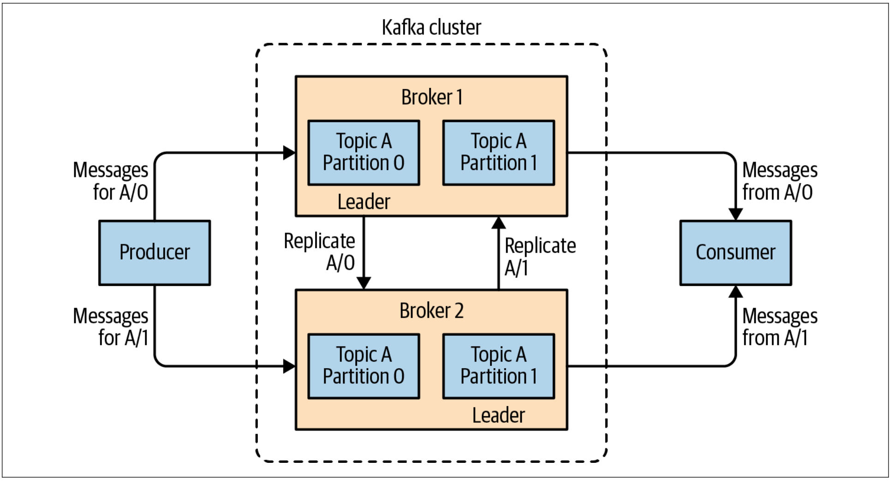
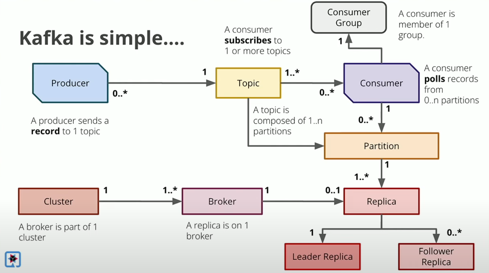

>[Back to Week Menu](README.md)
>
>Previous Theme: [Introduction to Stream Processing](intro_stream_processing.md)
>
>Next Theme: [Confluent cloud](confluent_cloud.md)

# Introduction to Kafka

## What is Kafka?

_[Video source](https://www.youtube.com/watch?v=zPLZUDPi4AY)_

[Apache Kafka](https://kafka.apache.org/Kafka) is an open-source distributed event streaming platform for high-performance data pipelines, streaming analytics, data integration, and mission-critical applications. Kafka
provides a high-throughput and low-latency platform for handling real-time data feeds.

Kafka runs as a cluster in one or more servers. The Kafka cluster stores streams of records in categories called topics.
Each record has a key, value, and a timestamp.

It was originally developed at LinkedIn and was subsequently open-sourced under the Apache Software Foundation in 2011.
It’s widely used for high-performance use cases like streaming analytics and data integration.

See [org.apache.kafka](https://javadoc.io/doc/org.apache.kafka) Javadocs.

## Kafka

### Overview

Kafka is a distributed system comprising several key components. These are four main parts in a Kafka system:

- **Broker**: Handles all requests from clients (produce, consume, and metadata) and keeps data replicated within the
  cluster. There can be one or more brokers in a cluster.
- **Zookeeper** (now **KRaft**): Keeps the state of the cluster (brokers, topics, users).
- **Producer**: Sends records to a broker.
- **Consumer**: Consumes batches of records from the broker.

A **record** is the most elemental unit of persistence in Kafka. In the context of event-driven architecture, a record
typically corresponds to some event of interest. It is characterised by the following attributes:

- **Key**: A record can be associated with an optional non-unique key, which acts as a king of classifier, grouping
  relatied records on the basis of their key.
- **Value**: A value is effectively the informational payload of a record.
- **Headers**: A set of free-form key-value pairs that can optionally annotate a record.
- **Partition number**: A zero-based index of the partition that the record appears in. A record must always be tied to
  exactly one partition.
- **Offset**: A 64-bit signed integer for locating a record within its encompassing partition.
- **Timestamp**: A millisecond-precise timestamp of the record.

A **partition** is a totally ordered, unbounded set of records. Published records are appended to the head-end of the
encompassing partition. Where a record can be seen as an elemental unit of persistence, a partition is an elemental unit
of record streaming. In the absence of producer synchronisation, causal order can only be achieved when a single
producer emits records to the same partition.

A **topic** is a logical aggregation of partitions. It comprises one or more partitions, and a partition must be a part
of exactly one topic. Earlier, it was said that partitions exhibit total order. Taking a set-theoretic perspective, a
topic is just a union of the individual underlying sets; since partitions within a topic are mutually independent, the
topic is said to exhibit partial order. In simple terms, this means that certain records may be ordered in relation to
one another, while being unordered with respect to certain other records.

A **cluster** hosts multiple topics, each having an assigned leader and zero or more follower replicas.


### Main Concepts

See [Streams Concepts](https://docs.confluent.io/platform/current/streams/concepts.html#streams-concepts).

- **Publish/subscribe messaging** is a pattern that is characterized by the sender (publisher) of a piece of data
  (message) not specifically directing it to a receiver.
- These systems often have a **broker**, a central point where messages are published, to facilitate this pattern.
- The unit of data within Kafka is called a **message**.
- A message can have an optional piece of metadata, which is referred to as a **key**.
- While messages are opaque byte arrays to Kafka itself, it is recommended that additional structure, or **schema**, be
  imposed on the message content so that it can be easily understood.
- Messages in Kafka are categorized into **topics**. The closest analogies for a topic are a database table or a folder
  in a filesystem.
- Topics are additionally broken down into a number of **partitions**.
- A **stream** is considered to be a single topic of data, regardless of the number of partitions, moving from the
  producers to the consumers.
- **Producers** create new messages. In other publish/subscribe systems, these may be called **publishers** or
  **writers**.
- **Consumers** read messages. In other publish/subscribe systems, these clients may be called **subscribers** or
  **readers**.
- The consumer keeps track of which messages it has already consumed by keeping track of the **offset** of messages. The
  **offset**, an integer value that continually increases, is another piece of metadata that Kafka adds to each message
  as it is produced.
- Consumers work as part of a **consumer group**, which is one or more consumers that work together to consume a topic.
- A single Kafka server is called a **broker**. The broker receives messages from producers, assigns offsets to them,
  and writes the messages to storage on disk.
- Kafka brokers are designed to operate as part of a **cluster**.
- Within a **cluster of brokers**, one broker will also function as the cluster **controller** (elected automatically
  from the live members of the cluster).
- A partition is owned by a single broker in the cluster, and that broker is called the **leader** of the partition
- A replicated partition is assigned to additional brokers, called **followers** of the partition.

**Replication of partitions in a cluster**



- A key feature of Apache Kafka is that of **retention**, which is the durable storage of messages for some period of
  time. Kafka brokers are configured with a default retention setting for topics, either retaining messages for some
  period of time (e.g., 7 days) or until the partition reaches a certain size in bytes (e.g., 1 GB).

### Kafka is simple…​

**Kafka is simple**



This picture comes from [Kafka: A map of traps for the enlightened dev and
op](https://www.youtube.com/watch?v=paVdXL5vDzg&t=1s) by Emmanuel Bernard And Clement Escoffier on Youtube.

### Installation

We can install Kafka locally.

If you have already installed Homebrew for macOS, you can use it to install Kafka in one step. This will ensure that you
have Java installed first, and it will then install Apache Kafka 2.8.0 (as of the time of writing).

``` bash
$ brew install kafka
```

Homebrew will install Kafka under `/opt/homebrew/Cellar/kafka/`.

But, in this course, we use [Confluent Cloud](https://www.confluent.io/confluent-cloud/). Confluent cloud provides a
free 30 days trial for, you can signup [here](https://www.confluent.io/confluent-cloud/tryfree/).

### Topic

Topic is a container stream of events. An event is a single data point in timestamp.

Multiple producers are able to publish to a topic, picking a partition at will. The partition may be selected directly —
by specifying a partition number, or indirectly — by way of a record key, which deterministically hashes to a partition
number.

Each topic can have one or many consumers which subscribe to the data written to the topic.

### Partition

A Kafka Topic is grouped into several partitions for scalability. Each partition is an sequence of records that are
continually added to a structured commit log. A sequential ID number called the offset is assigned to each record in the
partition.

### Logs

Kafka logs are a collection of various data segments present on your disk, having a name as that of a form-topic
partition or any specific topic-partition. Each Kafka log provides a logical representation of a unique topic-based
partitioning.

Logs are how data is actually stored in a topic.

### Event

Each event contains a number of messages. A message has properties.

### Message

The basic communication abstraction used by producers and consumers in order to share information in Kafka is called a
**message**.

Messages have 3 main components:

- **Key**: used to identify the message and for additional Kafka stuff such as partitions (covered later).
- **Value**: the actual information that producers push and consumers are interested in.
- **Timestamp**: used for logging.

### Why Kafka?

**Kafka brings robustness**: For example, when a server goes down, we can still access the data. Apache Kafka achieves a
certain level of resiliency through replication, both across machines in a cluster and across multiple clusters in
multiple data centers.

**Kafka offers a lot of flexibility**: The data exchange application can be small or very large. Kafka can be connected
to multiple databases with Kafka connect

**Kafka provides scalability**: Kafka has no problem handling a number of events that increases dramatically in a short
time.

### Availability of messages

When a consumer reads a message, that message is not lost and is still available to other consumers. There is some kind
of expiration date for messages.

### Need of stream processing

Before, we often had monolithic applications. Now, we can have several microservices talking to each other. Kafka helps
simplify data exchange between these microservices

See also [What is Apache Kafka](https://kafka.apache.org/intro) for more.

_[Back to the top](#what-is-kafka)_