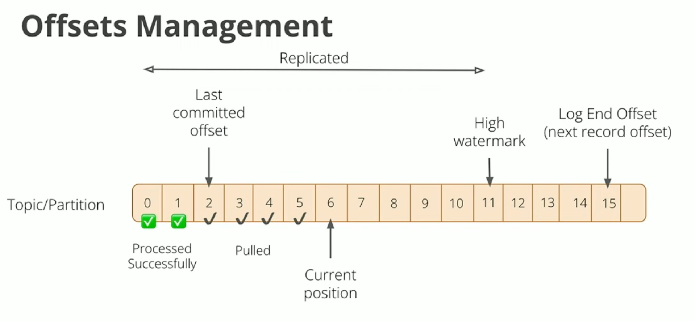

>[Back to Week Menu](README.md)
>
>Previous Theme:  [Kafka producer consumer](kafka_producer_consumer.md)
>
>Next Theme: [Kafka Streams Basics](kafka_streams_basics.md)

## Kafka Configuration

_[Video source](https://www.youtube.com/watch?v=SXQtWyRpMKs)_

### What is a Kafka cluster?

Kafka cluster is nodes of machines that communicate with each other.

Kafka has recently shifted from [ZooKeeper](https://zookeeper.apache.org/) to a quorum-based controller that uses a new
consensus protocol called Kafka Raft, shortened as Kraft (pronounced “craft”).

Being a distributed system with high availability and fault-tolerant, Kafka requires a mechanism for coordinating
multiple decisions between all the active brokers. It also requires maintaining a consistent view of the cluster and its
configurations. Kafka has been using ZooKeeper to achieve this for a long time now.

But, ZooKeeper adds an extra management layer for Kafka. Managing distributed systems is a complex task, even if it’s as
simple and robust as ZooKeeper. This is one of the reasons why it was deemed preferable for Kafka to rely for this
purpose on internal mechanisms.

Apache Kafka Raft (KRaft) is the consensus protocol that was introduced to remove Apache Kafka’s dependency on ZooKeeper
for metadata management. This greatly simplifies Kafka’s architecture by consolidating responsibility for metadata into
Kafka itself, rather than splitting it between two different systems: ZooKeeper and Kafka.

See [Kafka’s Shift from ZooKeeper to Kraft](https://www.baeldung.com/kafka-shift-from-zookeeper-to-kraft) and [KRaft:
Apache Kafka Without ZooKeeper](https://developer.confluent.io/learn/kraft/) for more information.

_[Back to the top](#kafka-configuration)_

### What is a topic?

A topic is a sequence of events coming in.

A Topic is a category/feed name to which records are stored and published. All Kafka records are organized into topics.
Producer applications write data to topics and consumer applications read from topics. Records published to the cluster
stay in the cluster until a configurable retention period has passed by.

See [Topics](https://developer.confluent.io/learn-kafka/apache-kafka/topics/) and [What is Apache
Kafka?](https://www.cloudkarafka.com/blog/part1-kafka-for-beginners-what-is-apache-kafka.html) for more.

Kafka topics are the categories used to organize messages. Messages are sent to and read from specific topics. Each
message has a key, a value and a timestamp.

_[Back to the top](#kafka-configuration)_

### How Kafka provides availability?

Suppose we have a cluster with three nodes (N0, N1, N2). Each node communicating with each other.

Suppose also we have one topic. This topic leaves in N1.

What happens when N1 goes down? This is where the concept of replication comes in.

Each node replicates its messages to another node. N1 is the leader, N0 and N2 are the followers. The producer writes a
message to N1 and the consumers read the message from N1. But as leader, N1 replicates this message to N0.

If N1 goes down, the producer and consumers will be automatically redirected to N0. Additionally, N0 will now act as the
leader and replicate messages to N2.

_[Back to the top](#kafka-configuration)_

### Replication Factor

Apache Kafka ensures high data availability by replicating data via the replication factor in Kafka. The replication factor is the number of nodes to which your data is replicated.

When a producer writes data to Kafka, it sends it to the broker designated as the **Leader** for that topic:partition in the cluster. Such a broker is the entry point to the cluster for the topic’s data:partition.

If we use **replication factor** > 1, writes will also propagate to other brokers called **followers**. This
fundamental operation enables Kafka to provide high availability (HA).

See [Kafka Replication and Committed
Messages](https://docs.confluent.io/kafka/design/replication.html#kafka-replication-and-committed-messages) and [Apache
Kafka replication factor – What’s the perfect
number?](https://www.cloudkarafka.com/blog/apache-kafka-replication-factor-perfect-number.html) for more.

_[Back to the top](#kafka-configuration)_

### Retention Period

When a producer sends a message to Apache Kafka, it appends it in a log file and retains it for a configured duration.

With retention period properties in place, messages have a TTL (time to live). Upon expiry, messages are marked for deletion, thereby freeing up the disk space. (For example - retention period - 1 day)

The same retention period property applies to all messages within a given Kafka topic.

See [Configuring Message Retention Period in Apache Kafka](https://www.baeldung.com/kafka-message-retention) for more.

_[Back to the top](#kafka-configuration)_

### Partitions

Partitioning takes the single topic log and breaks it into multiple logs, each of which can live on a separate node in the Kafka cluster.
Each partition is also replicated to the other nodes of the cluster. This way, the work of storing messages, writing new messages, and processing existing messages can be split among many nodes in the cluster.

[Introduction to Apache Kafka Partitions](https://developer.confluent.io/learn-kafka/apache-kafka/partitions/) and [Main
Concepts and Terminology](https://kafka.apache.org/documentation/#intro_concepts_and_terms) for more.

_[Back to the top](#kafka-configuration)_

### Consumer Groups

Kafka consumers are typically part of a **Consumer Group**. When multiple consumers are subscribed to a topic and belong to the same consumer group, each consumer in the group will receive messages from a different subset of the partitions in the topic.

More precisely, a **Consumer Group** is a set of consumers which cooperate to consume data from some topics. The partitions of all the topics are divided among the consumers in the group. As new group members arrive and old members
leave, the partitions are re-assigned so that each member receives a proportional share of the partitions. This is known as rebalancing the group.

See [Chapter 4. Kafka Consumers: Reading Data from
Kafka](https://www.oreilly.com/library/view/kafka-the-definitive/9781491936153/ch04.html) from Kafka: The Definitive
Guide book.

_[Back to the top](#kafka-configuration)_

### Consumer Offset

The **Consumer Offset** is a way of tracking the sequential order in which messages are received by Kafka topics.
Keeping track of the offset, or position, is important for nearly all Kafka use cases and can be an absolute necessity in certain instances, such as financial services.

The Kafka consumer works by issuing "fetch" requests to the brokers leading the partitions it wants to consume. 
The consumer offset is specified in the log with each request. The consumer receives back a chunk of log beginning from the offset position. The consumer has significant control over this position and can rewind it to re-consume data if desired.

See [Kafka Consumer](https://docs.confluent.io/platform/current/clients/consumer.html) for more information about
offset.

Kafka brokers use an internal topic named `__consumer_offsets` that keeps track of what messages a given consumer group
last successfully processed.

As we know, each message in a Kafka topic has a partition ID and an offset ID attached to it.

Therefore, in order to "checkpoint" how far a consumer has been reading into a topic partition, the consumer will
regularly **commit** the latest processed message, also known as **consumer offset**.

**Offsets Management**

_[Back to the top](#kafka-configuration)_

### `auto.offset.reset` configuration

The `auto.offset.reset` property controls the behavior of the consumer when it starts reading a partition for which it
doesn’t have a committed offset or if the committed offset it has is invalid (usually because the consumer was down for
so long that the record with that offset was already aged out of the broker).

- The default is `latest`, which means that lacking a valid offset, the consumer will start reading from the newest
  records (records that were written after the consumer started running).
- The alternative is `earliest` which means that lacking a valid offset, the consumer will read all the data in the
  partition, starting from the very beginning.

See also [auto.offset.reset](https://kafka.apache.org/documentation/#consumerconfigs_auto.offset.reset) from Kafka
Documentation.

_[Back to the top](#kafka-configuration)_

### Acknowledgment

The number of acknowledgments the producer requires the leader to have received before considering a request complete.
This controls the durability of records that are sent. The following settings are allowed:

- `acks=0`: If set to zero then the producer will not wait for any acknowledgment from the server at all. The record will be immediately added to the socket buffer and considered sent. No guarantee can be made that the server has received the record in this case, and the retries configuration will not take effect (as the client won’t generally know of any failures). The offset given back for each record will always be set to `-1`.
- `acks=1`: This will mean the leader will write the record to its local log but will respond without awaiting full acknowledgement from all followers. In this case should the leader fail immediately after acknowledging the record but before the followers have replicated it then the record will be lost.
- `acks=all`: This means the leader will wait for the full set of in-sync replicas to acknowledge the record. This guarantees that the record will not be lost as long as at least one in-sync replica remains alive. This is the
  strongest available guarantee. This is equivalent to the `acks=-1` setting.

The option chosen depends on the desired speed of the application and whether or not all records are actually read and not lost in the event of a failure. We should use `acks=all` for a financial application because it is more important not to lose data than to lose a few milliseconds.

See [acks](https://docs.confluent.io/platform/current/installation/configuration/producer-configs.html#acks) from
Confluent Documentation.

_[Back to the top](#kafka-configuration)_

### Recap in one minute

- Kafka cluster is a set of nodes talking to each other running Kafka.
- Topic is a collection of events created by a producer.
- Inside topic, there are messages composed of a key, a value and a timestamp.
- Replication Factor is equivalent to the number of nodes where data are replicated.
- What happens if one of the nodes goes down and how does the leader follower changes.
- Retention and how messages would be deleted after a certain amount of time which you as producer can set.
- Partitions and how partitions are stored inside the nodes.
- How consumers can consume from different partitions. We need to have multiple partitions so that different consumers
  can consume and we can parallelize our stuff.
- Consumer Group…
- Offset…
- `auto.offset.reset`…
- Acknowledgment…

_[Back to the top](#kafka-configuration)_

### Documentation

Kafka provides a lot of configurations. See [Configuration](https://kafka.apache.org/documentation/#configuration) from Kafka Documentation.

_[Back to the top](#kafka-configuration)_