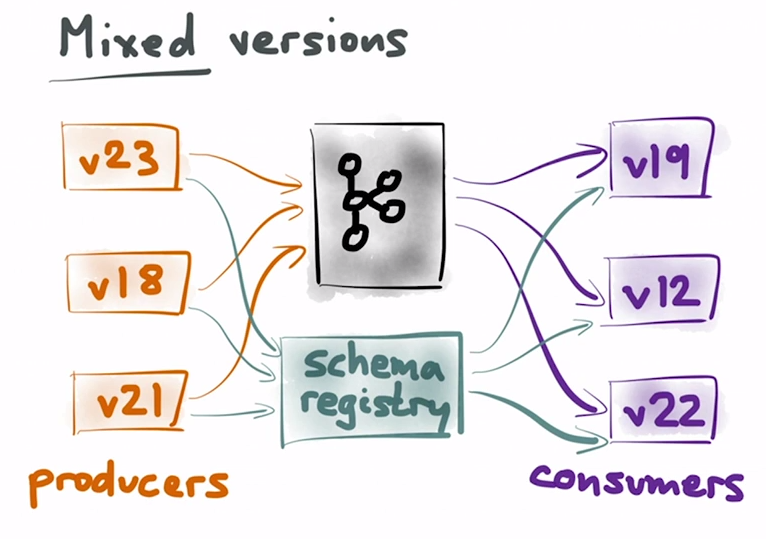

>[Back to Week Menu](README.md)
>
>Previous Theme:  [Kafka ksqldb & Connect](kafka_ksqldb_connect.md)
>
>Next Theme: [Streaming with Python](kafka_python.md)

# Kafka Streams

_[Video source](https://www.youtube.com/watch?v=tBY_hBuyzwI)_

## Kafka Schema registry

### Why are schemas needed?

Kafka messages can be anything, from plain text to binary objects. This makes Kafka very flexible but it can lead to
situations where consumers can’t understand messages from certain producers because of incompatibility.

In order to solve this, we can introduce a **schema** to the data so that producers can define the kind of data they’re
pushing and consumers can understand it.

### Kafka Schema registry

The **schema registry** is a component that stores schemas and can be accessed by both producers and consumers to fetch them.

This is the usual workflow of a working schema registry with Kafka:


- The producer checks the schema registry, informing it that they want to publish to some particular topic with schema
  v1.
- The registry verifies the schema.
  - If no schema exists for the subject, he saves the schema and gives his consent to the producer.
  - If a schema already exists for the subject, the registry checks for compatibility with the producer and registered
    schemas.
  - If the compatibility check passes, the registry sends a message back to the producer giving them permission to start
    publishing messages.
  - If the check fails, the registry tells the producer that the schema is incompatible and the producer returns an
    error.
- The producer starts sending messages to the topic using the v1 schema to a Kafka broker.
- When the consumer wants to consume from a topic, it checks with the Schema Registry which version to use.

[Confluent Schema Registry](https://docs.confluent.io/platform/current/schema-registry/index.html) provides a serving
layer for your metadata. It provides a RESTful interface for storing and retrieving your Avro, JSON Schema, and Protobuf
schemas. It stores a versioned history of all schemas based on a specified subject name strategy, provides multiple
compatibility settings and allows evolution of schemas according to the configured compatibility settings and expanded
support for these schema types. It provides serializers that plug into Apache Kafka clients that handle schema storage
and retrieval for Kafka messages that are sent in any of the supported formats.

See [Schema Registry Overview](https://docs.confluent.io/platform/current/schema-registry/index.html) and [Apache Kafka®
101: Schema Registry](https://www.youtube.com/watch?v=_x9RacHDQY0) for more.

### Avro

Many Kafka developers favor the use of [Apache Avro](https://avro.apache.org/) which is an open source project that
provides data serialization and data exchange services for Apache Hadoop.

Avro provides a compact serialization format, schemas that are separate from the message payloads and that do not
require code to be generated when they change, and strong data typing and schema evolution, with both backward and
forward compatibility.

In the following figure we have summarized some reasons what makes the framework so ingenious.


See [Apache Avro – Effective Big Data Serialization Solution for
Kafka](https://starship-knowledge.com/category/net-core) and [Exploring Avro as a Kafka data
format](https://inakianduaga.github.io/kafka-image-processor/#/) for more.

### Schema evolution and compatibility

An important aspect of data management is schema evolution. After the initial schema is defined, applications may need to evolve it over time. When this happens, it’s critical for the downstream consumers to be able to handle data encoded with both the old and the new schema seamlessly.

We can define 3 different kinds of evolutions for schemas:

- **Forward compatibility** means that data produced with a new version of schema (v2) can be read by consumers using the old schema version (v1), even though they may not be able to use the full capabilities of the new schema. For example, a new optional field was added to schema and consumers can read data without this field. 
- **Backward compatibility** means that consumers can read data, produced with old schema version (v1), using the new schema version (v2).
- **Full** (or **mixed**) compatibility means schemas are both backward and forward compatible.

<table>
<tr><td>

</td><td>

</td><td>

</td></tr>
</table>

See [Schema Evolution and Compatibility](https://docs.confluent.io/platform/current/schema-registry/avro.html) for more.


### Code example
- Create `avro` file `rides.avsc`:
```
{
       "type": "record",
       "name":"RideRecord",
       "namespace": "schemaregistry",
       "fields":[
         {"name":"vendor_id","type":"string"},
         {"name":"passenger_count","type":"int"},
         {"name":"trip_distance","type":"double"}
       ]
}
```
- In UI create topic `rides_avro` with 2 partitions and retention time = 1 day.
- Then the instructor explained
[AvroProducer.java](java/kafka_examples/src/main/java/org/example/AvroProducer.java).
- Go to UI to Environment and create a Schema Registry key and secret and add it to `Secret.java`.
- Copy endpoint for Schema Registry to prop `AbstractKafkaAvroSerDeConfig.SCHEMA_REGISTRY_URL_CONFIG` in `AvroProducer.java`.

**File `AvroProducer.java`**

``` java
public class AvroProducer {

    private Properties props = new Properties();

    public AvroProducer() {
        String BOOTSTRAP_SERVER = "pkc-41voz.northamerica-northeast1.gcp.confluent.cloud:9092";

        props.put(StreamsConfig.BOOTSTRAP_SERVERS_CONFIG, BOOTSTRAP_SERVER);
        props.put("security.protocol", "SASL_SSL");
        props.put("sasl.jaas.config",
            "org.apache.kafka.common.security.plain.PlainLoginModule required username='"
            + kafkaClusterKey + "' password='" + kafkaClusterSecret + "';");
        props.put("sasl.mechanism", "PLAIN");
        props.put("client.dns.lookup", "use_all_dns_ips");
        props.put("session.timeout.ms", "45000");
        props.put(ProducerConfig.ACKS_CONFIG, "all");
        props.put(ProducerConfig.KEY_SERIALIZER_CLASS_CONFIG, "org.apache.kafka.common.serialization.StringSerializer");
        props.put(ProducerConfig.VALUE_SERIALIZER_CLASS_CONFIG, KafkaAvroSerializer.class.getName());

        props.put(AbstractKafkaAvroSerDeConfig.SCHEMA_REGISTRY_URL_CONFIG, "https://psrc-kk5gg.europe-west3.gcp.confluent.cloud");
        props.put("basic.auth.credentials.source", "USER_INFO");
        props.put("basic.auth.user.info", schemaRegistryKey + ":" + schemaRegistrySecret);
    }

    public List<RideRecord> getRides() throws IOException, CsvException {
        var ridesStream = this.getClass().getResource("/rides.csv");
        var reader = new CSVReader(new FileReader(ridesStream.getFile()));
        reader.skip(1);

        return reader.readAll().stream().map(row ->
            RideRecord.newBuilder()
                    .setVendorId(row[0])
                    .setTripDistance(Double.parseDouble(row[4]))
                    .setPassengerCount(Integer.parseInt(row[3]))
                    .build()
                ).collect(Collectors.toList());
    }

    public void publishRides(List<RideRecord> rides) throws ExecutionException, InterruptedException {
        KafkaProducer<String, RideRecord> kafkaProducer = new KafkaProducer<>(props);
        for (RideRecord ride : rides) {
            var record = kafkaProducer.send(new ProducerRecord<>("rides_avro", String.valueOf(ride.getVendorId()), ride), (metadata, exception) -> {
                if (exception != null) {
                    System.out.println(exception.getMessage());
                }
            });
            System.out.println(record.get().offset());
            Thread.sleep(500);
        }
    }

    public static void main(String[] args) throws IOException, CsvException, ExecutionException, InterruptedException {
        var producer = new AvroProducer();
        var rideRecords = producer.getRides();
        producer.publishRides(rideRecords);
    }
}
```

The central part of the Producer API is Producer class. Producer class provides an option to connect Kafka broker in its constructor by the following methods.

[KafkaProducer](https://javadoc.io/static/org.apache.kafka/kafka-clients/3.4.0/org/apache/kafka/clients/producer/KafkaProducer.html)
is a Kafka client that publishes records to the Kafka cluster.

The producer class provides `.send()` method to send messages to either single or multiple topics using the following signatures `public void send(KeyedMessaget<k,v> message)` sends the data to a single topic, partitioned by key using either sync or async producer.

[ProducerRecord](https://javadoc.io/static/org.apache.kafka/kafka-clients/3.4.0/org/apache/kafka/clients/producer/ProducerRecord.html)
is a key/value pair to be sent to Kafka. This consists of a topic name to which the record is being sent, an optional
partition number, and an optional key and value.

We need also to configure the producer to use Schema Registry and the `KafkaAvroSerializer` class. We need to import
this class and Avro dependencies into our Gradle project (I think
[io.confluent:kafka-avro-serializer:5.3.0](https://mvnrepository.com/artifact/io.confluent/kafka-avro-serializer) and
[org.apache.avro:avro:1.11.1](https://mvnrepository.com/artifact/org.apache.avro/avro)).

To write the consumer, you will need to configure it to use Schema Registry and to use the `KafkaAvroDeserializer`.

The `rides.csv` file is
[here](java/kafka_examples/src/main/resources/rides.csv).

### Run this

The instructor runs AvroProducer and sees that messages are being created in Confluent Cloud.

### Example with modified schema

After modifying Schema by changing field `vendor_id` type from `string` to `int` in `rides.avsc`, it failed because registered schema is incompatible. 

Do smt with gradle (`./gradlew clean build`).

If add new field and run AvroProducer, then in UI in Topic we'll see new messages with new schema. Also, in Schema Registry we can see and compare our schemas.

## Conclusion


## Selected links

- Kafka Documentation

  - [Documentation](https://kafka.apache.org/documentation/)
  - [Run Kafka Streams demo application](https://kafka.apache.org/documentation/streams/quickstart)
  - [APIs and Javadocs](https://docs.confluent.io/platform/current/api-javadoc/index.html#apis-and-javadocs)
  - [Javadocs](https://javadoc.io/doc/org.apache.kafka/kafka-clients/latest/index.html)
- Books
  - [Kafka: The Definitive Guide](https://www.oreilly.com/library/view/kafka-the-definitive/9781491936153/) by Neha
    Narkhede, Gwen Shapira, Todd Palino (O’Reilly)
  - [Kafka in Axtion](https://www.manning.com/books/kafka-in-action) by Dylan Scott, Viktor Gamov, Dave Klein (Manning)
- Courses/Tutorials
  - [Apache Kafka QuickStart](https://kafka.apache.org/quickstart)
  - [Learn Apache Kafka](https://developer.confluent.io/learn-kafka/) from Confluent
  - [Conduktor Kafkademy](https://www.conduktor.io/kafka)
  - [Apache Kafka for beginners](https://www.cloudkarafka.com/blog/part1-kafka-for-beginners-what-is-apache-kafka.html)
    from cloudkarafka
  - [Kafka: a map of traps for the enlightened dev and op](https://www.youtube.com/watch?v=paVdXL5vDzg&t=1s) by Emmanuel
    Bernard And Clement Escoffier
- Tools
  - [Kafdrop](https://github.com/obsidiandynamics/kafdrop) is a web UI for viewing Kafka topics and browsing consumer
    groups.
- Others
  - [awesome-kafka](https://github.com/infoslack/awesome-kafka/blob/master/README.md)


_[Back to the top](#kafka-schema-registry)_