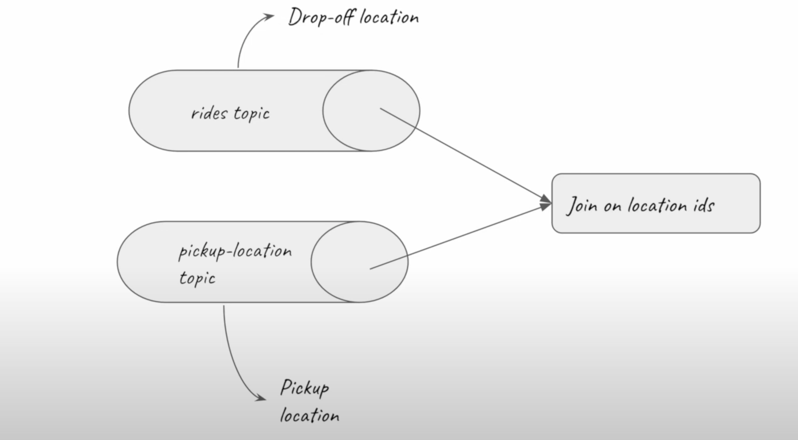

>[Back to Week Menu](README.md)
>
>Previous Theme:  [Kafka Streams Basics](kafka_streams_basics.md)
>
>Next Theme: [Kafka stream testing](kafka_stream_testing.md)

# Kafka Streams

[Slides](https://docs.google.com/presentation/d/1fVi9sFa7fL2ZW3ynS5MAZm0bRSZ4jO10fymPmrfTUjE/edit?usp=sharing)

_[Video source](https://www.youtube.com/watch?v=NcpKlujh34Y)_

## Kafka stream join

We will build a topology on base of our Stream application to make an example in which will have **2 topics** and data from them will be joined.



### Example use case

For this example, we have a **rides** topic with drop-off location as key. We will create another topic which is called a **pickup-location** topic. The pickup location will be inside the message itself. We will use location_id to join these two topics.

### Java Code explained

The instructor has already setup this example. See
[JsonKStreamJoins.java](java/kafka_examples/src/main/java/org/example/JsonKStreamJoins.java).

The instructor briefly explains the code of `JsonKStreamJoins` and `JsonProducerPickupLocation`.

### Processor Topology

A **topology** (short for **processor topology**) defines the stream computational logic for our app. In other words, it
defines how input data is transformed into output data.

Essentially, a topology is a graph of **stream processors** (the graph nodes) which are connected by streams (the graph
edges). A topology is a useful abstraction to design and understand Streams applications. A **stream processor** is a
node which represents a processing step (i.e. it transforms data), such as map, filter, join or aggregation.

See [Processor Topology](https://docs.confluent.io/platform/current/streams/architecture.html#processor-topology) for
more.

### `createTopology()` method

First, to simplify the code, we created a static method `Serde<T>` to serialize and deserialize objects.

**File `CustomSerdes.java`**

``` java
public static <T> Serde<T> getSerde(Class<T> classOf) {
    Map<String, Object> serdeProps = new HashMap<>();
    serdeProps.put("json.value.type", classOf);
    final Serializer<T> mySerializer = new KafkaJsonSerializer<>();
    mySerializer.configure(serdeProps, false);

    final Deserializer<T> myDeserializer = new KafkaJsonDeserializer<>();
    myDeserializer.configure(serdeProps, false);
    return Serdes.serdeFrom(mySerializer, myDeserializer);
}
```

After, we create a topology method in `JsonKStreamJoins` class.

**File `JsonKStreamJoins.java`**

``` java
public Topology createTopology() {
    StreamsBuilder streamsBuilder = new StreamsBuilder();
    KStream<String, Ride> rides = streamsBuilder.stream(Topics.INPUT_RIDE_TOPIC, Consumed.with(Serdes.String(), CustomSerdes.getSerde(Ride.class)));
    KStream<String, PickupLocation> pickupLocations = streamsBuilder.stream(Topics.INPUT_RIDE_LOCATION_TOPIC, Consumed.with(Serdes.String(), CustomSerdes.getSerde(PickupLocation.class)));

    var pickupLocationsKeyedOnPUId = pickupLocations.selectKey(
        (key, value) -> String.valueOf(value.PULocationID));

    var joined = rides.join(pickupLocationsKeyedOnPUId, (ValueJoiner<Ride, PickupLocation, Optional<VendorInfo>>) (ride, pickupLocation) -> {
                var period = Duration.between(ride.tpep_dropoff_datetime, pickupLocation.tpep_pickup_datetime);
                if (period.abs().toMinutes() > 10) return Optional.empty();
                else return Optional.of(new VendorInfo(ride.VendorID, pickupLocation.PULocationID, pickupLocation.tpep_pickup_datetime, ride.tpep_dropoff_datetime));
            }, JoinWindows.ofTimeDifferenceAndGrace(Duration.ofMinutes(20), Duration.ofMinutes(5)),
            StreamJoined.with(Serdes.String(), CustomSerdes.getSerde(Ride.class), CustomSerdes.getSerde(PickupLocation.class)));

    joined.filter(((key, value) -> value.isPresent())).mapValues(Optional::get)
        .to(Topics.OUTPUT_TOPIC, Produced.with(Serdes.String(), CustomSerdes.getSerde(VendorInfo.class)));

    return streamsBuilder.build();
}
```

### Run `JsonKStreamJoins`

> Don't forget to create topics `rides_location` and `vendor_info` in UI

Run `JsonKStreamJoins`, `JsonKStreamJoins` and `JsonProducerPickupLocation`.

### What’s happens in Confluent Cloud

In topic `rides_location` we can see our messages produced by `JsonProducerPickupLocation` with **PULocationID = 186**.
In topic `vendor_info` - result of joining of topics `rides` and `rides_location`.

### Co-partitioning

Co-partitioning is an essential concept of Kafka Streams. It ensures that the behavior of two joined streams is what you’d expect. Say you have a stream of customer addresses and a stream of customer purchases, and you’d like to join them for a customer order stream. You need to ensure the two streams are co-partitioned before executing the join.

In fact, Kafka Streams does not permit joining streams that are not co-partitioned.

There are three criteria for co-partitioning.

- The input records for the join must have the same keying strategy
- The source topics must have the same number of partitions on each side
- Both sides of the join must have the same partitioning strategy in terms of hashing

See [Co-Partitioning with Apache Kafka](https://www.confluent.io/blog/co-partitioning-in-kafka-streams/) for more.

_[Back to the top](#kafka-stream-join)_