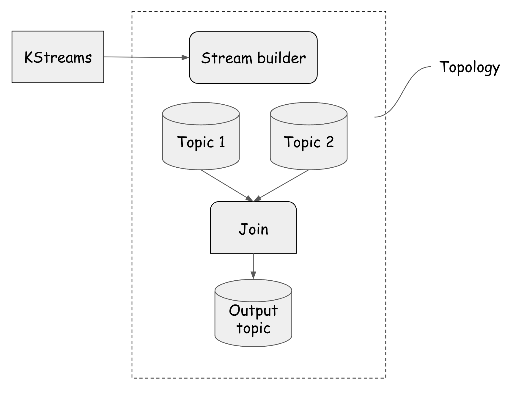

>[Back to Week Menu](README.md)
>
>Previous Theme:  [Kafka stream join](kafka_stream_join.md)
>
>Next Theme: [Kafka stream windowing](kafka_stream_windowing.md)

# Kafka Streams

_[Video source](https://www.youtube.com/watch?v=TNx5rmLY8Pk)_

## Kafka stream testing

We’ve covered the essential building blocks for building a Kafka Streams app. But there’s one crucial part of app development that I’ve left out so far: how to test your app.

In our count and join example, we basically played with two classes of Kafka streams: `KafkaStreams` and `StreamsBuilder`.

The `StreamsBuilder` does something like read from these two topics, maybe join them or rely on them and then, for example, publish it on another topic. This process of defining inside the `StreamsBuilder` basically which topics to read from which actions to actually take place and where to exit is called a **topology**.

And this is exactly what we can test.



### Extract topology

We will modify the code to extract topology. To do this, we will create `createTopology()` method inside `JsonKStream` class.

**File `JsonKStream.java`**

``` java
public Topology createTopology() {
    StreamsBuilder streamsBuilder = new StreamsBuilder();
    var ridesStream = streamsBuilder.stream("rides", Consumed.with(Serdes.String(), CustomSerdes.getSerde(Ride.class)));
    var puLocationCount = ridesStream.groupByKey().count().toStream();
    puLocationCount.to("rides-pulocation-count", Produced.with(Serdes.String(), Serdes.Long()));
    return streamsBuilder.build();
}

public void countPLocation() throws InterruptedException {
    var topology = createTopology();
    var kStreams = new KafkaStreams(topology, props);
    kStreams.start();
    while (kStreams.state() != KafkaStreams.State.RUNNING) {
        System.out.println(kStreams.state());
        Thread.sleep(1000);
    }
    System.out.println(kStreams.state());
    Runtime.getRuntime().addShutdownHook(new Thread(kStreams::close));
}
```

### Importing the test utilities

To test a Kafka Streams application, Kafka provides a test-utils artifact that can be added as regular dependency to your test code base.

In `build.gradle` file, we should add to the `build.gradle` file these dependencies :

``` txt
testImplementation 'org.junit.jupiter:junit-jupiter-api:5.8.1'
testRuntimeOnly 'org.junit.jupiter:junit-jupiter-engine:5.8.1'
testImplementation 'org.apache.kafka:kafka-streams-test-utils:3.3.1'
```

See [Testing Kafka Streams](https://kafka.apache.org/21/documentation/streams/developer-guide/testing.html) for more.

### Create a test class

The instructor creates `JsonKStreamTest` class. See
[JsonKStreamTest.java](java/kafka_examples/src/test/java/org/example/JsonKStreamTest.java).

**File `JsonKStreamTest.java`**

``` java
package org.example;

import org.apache.kafka.common.serialization.Serdes;
import org.apache.kafka.streams.*;
import org.example.customserdes.CustomSerdes;
import org.example.data.Ride;
import org.example.helper.DataGeneratorHelper;
import org.junit.jupiter.api.AfterAll;
import org.junit.jupiter.api.BeforeEach;
import org.junit.jupiter.api.Test;
import static org.junit.jupiter.api.Assertions.*;
import java.util.Properties;

class JsonKStreamTest {
    private Properties props;
    private static TopologyTestDriver testDriver;
    private TestInputTopic<String, Ride> inputTopic;
    private TestOutputTopic<String, Long> outputTopic;
    private Topology topology = new JsonKStream().createTopology();

    @BeforeEach
    public void setup() {
        props = new Properties();
        props.setProperty(StreamsConfig.APPLICATION_ID_CONFIG, "testing_count_application");
        props.setProperty(StreamsConfig.BOOTSTRAP_SERVERS_CONFIG, "dummy:1234");
        if (testDriver != null) {
            testDriver.close();
        }
        testDriver = new TopologyTestDriver(topology, props);
        inputTopic = testDriver.createInputTopic("rides", Serdes.String().serializer(), CustomSerdes.getSerde(Ride.class).serializer());
        outputTopic = testDriver.createOutputTopic("rides-pulocation-count", Serdes.String().deserializer(), Serdes.Long().deserializer());
    }

    @Test
    public void testIfOneMessageIsPassedToInputTopicWeGetCountOfOne() {
        Ride ride = DataGeneratorHelper.generateRide();
        inputTopic.pipeInput(String.valueOf(ride.DOLocationID), ride);

        assertEquals(outputTopic.readKeyValue(), KeyValue.pair(String.valueOf(ride.DOLocationID), 1L));
        assertTrue(outputTopic.isEmpty());
    }

    @Test
    public void testIfTwoMessageArePassedWithDifferentKey() {
        Ride ride1 = DataGeneratorHelper.generateRide();
        ride1.DOLocationID = 100L;
        inputTopic.pipeInput(String.valueOf(ride1.DOLocationID), ride1);

        Ride ride2 = DataGeneratorHelper.generateRide();
        ride2.DOLocationID = 200L;
        inputTopic.pipeInput(String.valueOf(ride2.DOLocationID), ride2);

        assertEquals(outputTopic.readKeyValue(), KeyValue.pair(String.valueOf(ride1.DOLocationID), 1L));
        assertEquals(outputTopic.readKeyValue(), KeyValue.pair(String.valueOf(ride2.DOLocationID), 1L));
        assertTrue(outputTopic.isEmpty());
    }

    @Test
    public void testIfTwoMessageArePassedWithSameKey() {
        Ride ride1 = DataGeneratorHelper.generateRide();
        ride1.DOLocationID = 100L;
        inputTopic.pipeInput(String.valueOf(ride1.DOLocationID), ride1);

        Ride ride2 = DataGeneratorHelper.generateRide();
        ride2.DOLocationID = 100L;
        inputTopic.pipeInput(String.valueOf(ride2.DOLocationID), ride2);

        assertEquals(outputTopic.readKeyValue(), KeyValue.pair("100", 1L));
        assertEquals(outputTopic.readKeyValue(), KeyValue.pair("100", 2L));
        assertTrue(outputTopic.isEmpty());
    }

    @AfterAll
    public static void tearDown() {
        testDriver.close();
    }
}
```

We use [JUnit 5](https://junit.org/junit5/) for testing. See [JUnit 5 User
Guide](https://junit.org/junit5/docs/current/user-guide/).

### Create a test for joins

The instructor creates also a test for joins. See
[JsonKStreamJoinsTest.java](java/kafka_examples/src/test/java/org/example/JsonKStreamJoinsTest.java).

**File `JsonKStreamJoinsTest.java`**

``` java
package org.example;

import org.apache.kafka.clients.consumer.ConsumerConfig;
import org.apache.kafka.common.internals.Topic;
import org.apache.kafka.common.serialization.Serdes;
import org.apache.kafka.streams.*;
import org.example.customserdes.CustomSerdes;
import org.example.data.PickupLocation;
import org.example.data.Ride;
import org.example.data.VendorInfo;
import org.example.helper.DataGeneratorHelper;
import org.junit.jupiter.api.AfterAll;
import org.junit.jupiter.api.BeforeEach;
import org.junit.jupiter.api.Test;

import javax.xml.crypto.Data;
import java.util.Properties;

import static org.junit.jupiter.api.Assertions.*;

class JsonKStreamJoinsTest {
    private Properties props = new Properties();
    private static TopologyTestDriver testDriver;
    private TestInputTopic<String, Ride> ridesTopic;
    private TestInputTopic<String, PickupLocation> pickLocationTopic;
    private TestOutputTopic<String, VendorInfo> outputTopic;

    private Topology topology = new JsonKStreamJoins().createTopology();
    @BeforeEach
    public void setup() {
        props = new Properties();
        props.setProperty(StreamsConfig.APPLICATION_ID_CONFIG, "testing_count_application");
        props.setProperty(StreamsConfig.BOOTSTRAP_SERVERS_CONFIG, "dummy:1234");
        if (testDriver != null) {
            testDriver.close();
        }
        testDriver = new TopologyTestDriver(topology, props);
        ridesTopic = testDriver.createInputTopic(Topics.INPUT_RIDE_TOPIC, Serdes.String().serializer(), CustomSerdes.getSerde(Ride.class).serializer());
        pickLocationTopic = testDriver.createInputTopic(Topics.INPUT_RIDE_LOCATION_TOPIC, Serdes.String().serializer(), CustomSerdes.getSerde(PickupLocation.class).serializer());
        outputTopic = testDriver.createOutputTopic(Topics.OUTPUT_TOPIC, Serdes.String().deserializer(), CustomSerdes.getSerde(VendorInfo.class).deserializer());
    }

    @Test
    public void testIfJoinWorksOnSameDropOffPickupLocationId() {
        Ride ride = DataGeneratorHelper.generateRide();
        PickupLocation pickupLocation = DataGeneratorHelper.generatePickUpLocation(ride.DOLocationID);
        ridesTopic.pipeInput(String.valueOf(ride.DOLocationID), ride);
        pickLocationTopic.pipeInput(String.valueOf(pickupLocation.PULocationID), pickupLocation);

        assertEquals(outputTopic.getQueueSize(), 1);
        var expected = new VendorInfo(ride.VendorID, pickupLocation.PULocationID, pickupLocation.tpep_pickup_datetime, ride.tpep_dropoff_datetime);
        var result = outputTopic.readKeyValue();
        assertEquals(result.key, String.valueOf(ride.DOLocationID));
        assertEquals(result.value.VendorID, expected.VendorID);
        assertEquals(result.value.pickupTime, expected.pickupTime);
    }


    @AfterAll
    public static void shutdown() {
        testDriver.close();
    }
}
```

### Conclusion

Now we can see that we can easily test our topologies using this methodology.

The instructor highly suggest us to write unit tests whatever language we are using, to be sure that our topology is working.


_[Back to the top](#kafka-stream-testing)_