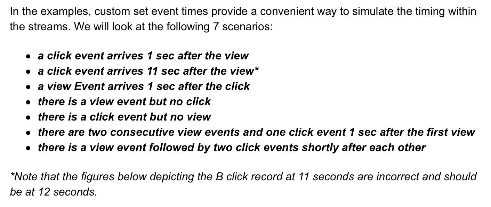
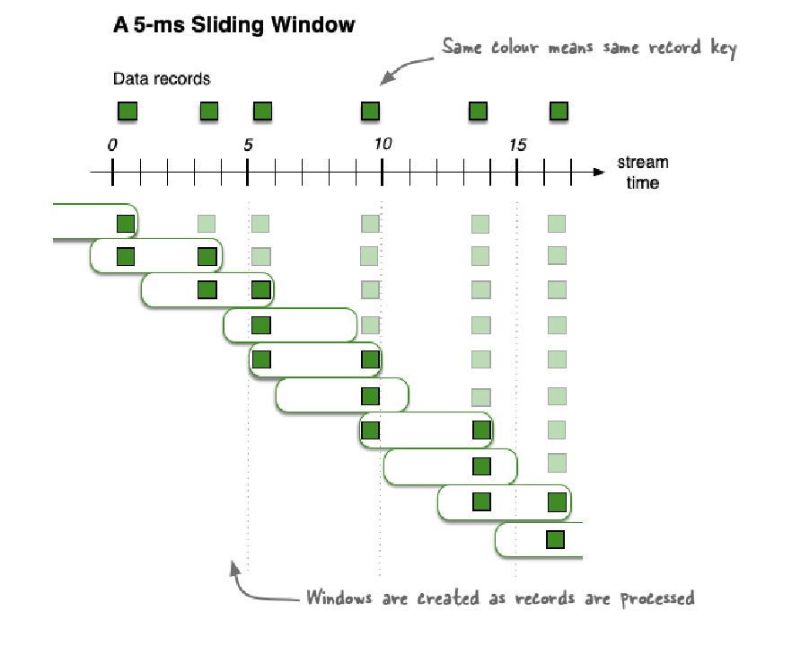

>[Back to Week Menu](README.md)
>
>Previous Theme:  [Kafka stream testing](kafka_stream_testing.md)
>
>Next Theme: 

# Kafka Streams

_[Video source](https://www.youtube.com/watch?v=r1OuLdwxbRc)_

## Kafka stream windowing

### Intro

We will cover some of the concepts of stream processing:
- Global KTables
- Joins in Kafka, types of joins
- Window-functions in Kafka


When dealing with streaming data, it’s important to make the distinction between these 2 concepts:

- **Streams** (aka **KStreams**) are individual messages that are read sequentially.
- **State** (aka **KTable**) can be thought of as a stream changelog: essentially a table which contains a view of the   stream at a specific point of time. KTables are also stored as topics in Kafka.

### Global KTable


Event streams are series or sequences of key value pairs, which are independent of each other.

In contrast to that, an update stream is also sequences of key value pairs, but instead of complimentary events that
each represent a single physical event, an update stream is an update that is applied to a previous value.

The main difference between a `KTable` and a `GlobalKTable` is that a `KTable` shards data between Kafka Streams
instances, while a `GlobalKTable` extends a full copy of the data to each instance.

See [KTable](https://developer.confluent.io/learn-kafka/kafka-streams/ktable) from Confluent Kafka Streams 101.

### Joining

Taking a leaf out of SQLs book, Kafka Streams supports three kinds of joins:


**Inner Joins**: Emits an output when both input sources have records with the same key.

**Left Joins**: Emits an output for each record in the left or primary input source. If the other source does not have a
value for a given key, it is set to null.

**Outer Joins**: Emits an output for each record in either input source. If only one source contains a key, the other is
null.

Another important aspect to consider are the input types. The following table shows which operations are permitted between KStreams and KTables:


See [Crossing the Streams – Joins in Apache Kafka](https://www.confluent.io/blog/crossing-streams-joins-apache-kafka/)
for more.

### Example of JOIN

We are going to use an example to demonstrate the differences in the joins. It is based on the online advertising domain. There is a Kafka topic that contains view events of particular ads and another one that contains click events based on those ads. Views and clicks share an ID that serves as the key in both topics.



#### Inner KStream-KStream Join Example


#### Left KStream-KStream Join Example


- For event in the **left** stream generated every time, when it arrives:
  - If event with the same key has previously arrived in the **right** stream it's joined with event in **left** stream;
  - If **hasn't** previously arrived in **right**, then joined with **Null (.)**
- For event in the **right** stream:
  - only joined if an event with the same key arrived previously in **left**.

#### Outer KStream-KStream Join Example


Output every time an event is processed in either stream.

#### Inner KTable-KTable Join Example


#### Left KTable-KTable Join Example


#### Outer KTable-KTable Join Example


#### Inner KStream-KTable Join Example


#### Left KStream-KTable Join Example


#### Inner KStream-GlobalKTable Join Example


#### Left KStream-GlobalKTable Join Example


### Windowing

In Kafka Streams, **windows** refer to a time reference in which a series of events happen.

Windowing allows you to bucket stateful operations by time, without which your aggregations would endlessly accumulate.
A window gives you a snapshot of an aggregate within a given timeframe, and can be set as hopping, tumbling, session, or
sliding.

- **Tumbling**: Fixed size non overlapping

- **Hopping**: Fixed size and overlapping

- **Sliding**: Fixed-size, overlapping windows that work on differences between record timestamps

- **Session**: Dynamically-sized, non-overlapping, data-driven windows


See also :

- [Tumbling time
  windows](https://docs.confluent.io/platform/current/streams/developer-guide/dsl-api.html#tumbling-time-windows).
- [Hopping time
  windows](https://docs.confluent.io/platform/current/streams/developer-guide/dsl-api.html#hopping-time-windows).
- [Session Windows](https://docs.confluent.io/platform/current/streams/developer-guide/dsl-api.html#session-windows).
- [Windowing](https://developer.confluent.io/learn-kafka/kafka-streams/windowing/) from Confluent Kafka Streams 101.
- [Apache Kafka Beyond the Basics: Windowing](https://www.confluent.io/blog/windowing-in-kafka-streams/).

### Code example

See
[JsonKStreamWindow.java](java/kafka_examples/src/main/java/org/example/JsonKStreamWindow.java).

Create topic `rides-pulocation-window-count` with 2 partitions in UI.

**File `JsonKStreamWindow.java`**

``` java
public Topology createTopology() {
    StreamsBuilder streamsBuilder = new StreamsBuilder();
    var ridesStream = streamsBuilder.stream("rides", Consumed.with(Serdes.String(), CustomSerdes.getSerde(Ride.class)));
    var puLocationCount = ridesStream.groupByKey()
            // A tumbling time window with a size of 10 seconds (and, by definition, an implicit
            // advance interval of 10 seconds), and grace period of 5 seconds.
            .windowedBy(TimeWindows.ofSizeAndGrace(Duration.ofSeconds(10), Duration.ofSeconds(5)))
            .count().toStream();
    var windowSerde = WindowedSerdes.timeWindowedSerdeFrom(String.class, 10*1000);

    puLocationCount.to("rides-pulocation-window-count", Produced.with(windowSerde, Serdes.Long()));
    return streamsBuilder.build();
}

public void countPLocationWindowed() {
    var topology = createTopology();
    var kStreams = new KafkaStreams(topology, props);
    kStreams.start();

    Runtime.getRuntime().addShutdownHook(new Thread(kStreams::close));
}

public static void main(String[] args) {
    var object = new JsonKStreamWindow();
    object.countPLocationWindowed();
}
```

Run `JsonProducer` and than run `JsonKStreamWindow`.

_[Back to the top](#kafka-stream-windowing)_