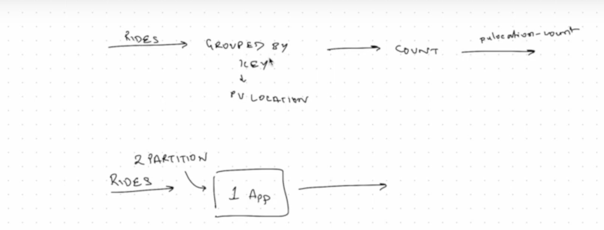
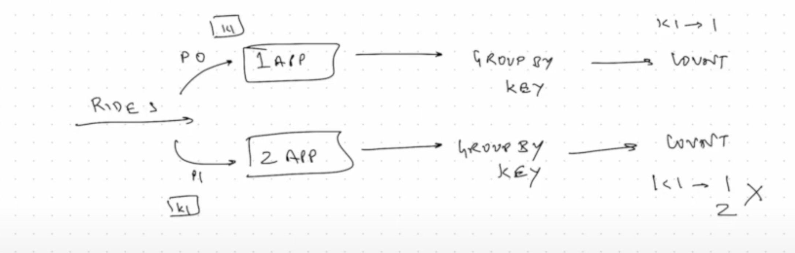
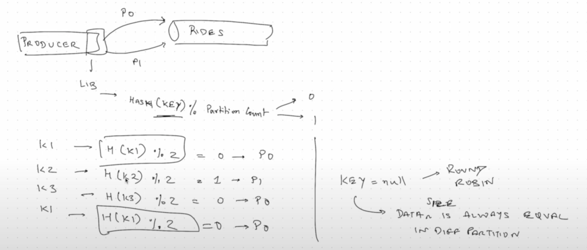

>[Back to Week Menu](README.md)
>
>Previous Theme:  [Kafka Configuration](kafka_config.md)
>
>Next Theme: [Kafka stream join](kafka_stream_join.md)

# Kafka Streams

[Slides](https://docs.google.com/presentation/d/1fVi9sFa7fL2ZW3ynS5MAZm0bRSZ4jO10fymPmrfTUjE/edit?usp=sharing)

_[Video source](https://www.youtube.com/watch?v=dUyA_63eRb0)_

## Kafka streams basics

In this section, we will create a very simple Kafka stream example. This example will be a basic building block which we will need to work on a more complicated case later on.

Also, we will see how keys play an important role when messages are outputted to Kafka, especially in stream processing

### `JsonKStream` class

### `getJsonSerde()` method

Serde method sets the serializer ("ser") and the deserializer ("de"). A SerDe (Serializer/Deserializer) is a way in
which Kafka interacts with data in various formats.

**File `JsonKStream.java`**

``` java
import io.confluent.kafka.serializers.KafkaJsonDeserializer;
import io.confluent.kafka.serializers.KafkaJsonSerializer;

private Serde<Ride> getJsonSerde() {
    Map<String, Object> serdeProps = new HashMap<>();
    serdeProps.put("json.value.type", Ride.class);
    final Serializer<Ride> mySerializer = new KafkaJsonSerializer<>();
    mySerializer.configure(serdeProps, false);

    final Deserializer<Ride> myDeserializer = new KafkaJsonDeserializer<>();
    myDeserializer.configure(serdeProps, false);
    return Serdes.serdeFrom(mySerializer, myDeserializer);
}
```

_[Back to the top](#kafka-streams-basics)_

### Properties

**File `JsonKStream.java`**

``` java
import org.apache.kafka.clients.consumer.ConsumerConfig;
import org.apache.kafka.streams.StreamsConfig;

private Properties props = new Properties();

public JsonKStream() {
    String BOOTSTRAP_SERVER = "pkc-41voz.northamerica-northeast1.gcp.confluent.cloud:9092";

    props.put(StreamsConfig.BOOTSTRAP_SERVERS_CONFIG, BOOTSTRAP_SERVER);
    props.put("security.protocol", "SASL_SSL");
    props.put("sasl.jaas.config",
        "org.apache.kafka.common.security.plain.PlainLoginModule required username='"
        + kafkaClusterKey + "' password='" + kafkaClusterSecret + "';");
    props.put("sasl.mechanism", "PLAIN");
    props.put("client.dns.lookup", "use_all_dns_ips");
    props.put("session.timeout.ms", "45000");
    props.put(StreamsConfig.APPLICATION_ID_CONFIG,
        "kafka_tutorial.kstream.count.plocation.v1");
    props.put(ConsumerConfig.AUTO_OFFSET_RESET_CONFIG, "latest");
    props.put(StreamsConfig.CACHE_MAX_BYTES_BUFFERING_CONFIG, 0);
}
```

**application ID** (`StreamsConfig.BOOTSTRAP_SERVERS_CONFIG`).  
Each stream processing application must have a unique ID. The same ID must be given to all instances of the application.

**cache.max.bytes.buffering** (`CACHE_MAX_BYTES_BUFFERING_CONFIG`)  
We set to zero this configuration to turn off caching. Note that this configuration is deprecated on the latest version
of Kafka.

See
[org.apache.kafka.streams.StreamsConfig](https://javadoc.io/static/org.apache.kafka/kafka-streams/3.4.0/org/apache/kafka/streams/StreamsConfig.html)
and
[org.apache.kafka.clients.consumer.ConsumerConfig](https://javadoc.io/static/org.apache.kafka/kafka-clients/3.4.0/org/apache/kafka/clients/consumer/ConsumerConfig.html)
for Kafka 3.4.0.

_[Back to the top](#kafka-streams-basics)_

### StreamsBuilder



- Create a StreamsBuilder. This **streamsBuilder** will stream from topic `rides`.
- Then `groupBy` and `count`.
- And stream result to another topic `rides-pulocation-count`.

**File `JsonKStream.java`**

``` java
import org.apache.kafka.common.serialization.Serdes;
import org.apache.kafka.streams.StreamsBuilder;

public void countPLocation() {
    StreamsBuilder streamsBuilder = new StreamsBuilder();
    var kstream = streamsBuilder.stream("rides", Consumed.with(Serdes.String(), getJsonSerde()));
    var kCountStream = kstream.groupByKey().count().toStream();
    kCountStream.to("rides-pulocation-count", Produced.with(Serdes.String(), Serdes.Long()));
}
```

[StreamsBuilder](https://javadoc.io/static/org.apache.kafka/kafka-streams/3.4.0/org/apache/kafka/streams/StreamsBuilder.html)
provide the high-level Kafka Streams DSL to specify a Kafka Streams topology. Topology will be explained in video 6.8.

_[Back to the top](#kafka-streams-basics)_

### Create a new topic in Confluent cloud

- In **Confluent cloud**, create a new topic `rides-pulocation-count` with 2 partitions.

- KafkaStreams instance

  We need to start our job explicitly by calling the start() method on the KafkaStreams instance. To do this, we add some
  instructions to the `countPLocation()` method.

**File `JsonKStream.java`**

``` java
import org.apache.kafka.common.serialization.Serdes;
import org.apache.kafka.streams.KafkaStreams;
import org.apache.kafka.streams.StreamsBuilder;

public void countPLocation() {
    StreamsBuilder streamsBuilder = new StreamsBuilder();
    var ridesStream = streamsBuilder.stream("rides", Consumed.with(Serdes.String(), getJsonSerde()));
    var puLocationCount = kstream.groupByKey().count().toStream();
    kCountStream.to("rides-pulocation-count", Produced.with(Serdes.String(), Serdes.Long()));

    var kStreams = new KafkaStreams(streamsBuilder.build(), props);
    kStreams.start();

    Runtime.getRuntime().addShutdownHook(new Thread(kStreams::close));
}
```

[KafkaStreams](https://javadoc.io/static/org.apache.kafka/kafka-streams/3.4.0/org/apache/kafka/streams/KafkaStreams.html)
is a Kafka client that allows for performing continuous computation on input coming from one or more input topics and
sends output to zero, one, or more output topics.

_[Back to the top](#kafka-streams-basics)_

### Run JsonKStream

Let’s run this class. Below, the `main()` method.

``` java
public static void main(String[] args) throws InterruptedException {
    var object = new JsonKStream();
    object.countPLocation();
}
```

_[Back to the top](#kafka-streams-basics)_

### `publishRides()` method in `JsonProducer` class

Instead of producing all the messages in one go, we just added a `Thread.sleep(500)` to our JsonProducer. We change also
the pickup datetime and dropoff datetime just to be now, so that travel times are 20 minutes.

**File `JsonProducer.java`**

``` java
public void publishRides(List<Ride> rides) throws ExecutionException, InterruptedException {
    KafkaProducer<String, Ride> kafkaProducer = new KafkaProducer<String, Ride>(props);
    for(Ride ride: rides) {
        ride.tpep_pickup_datetime = LocalDateTime.now().minusMinutes(20);
        ride.tpep_dropoff_datetime = LocalDateTime.now();
        var record = kafkaProducer.send(new ProducerRecord<>("rides", String.valueOf(ride.DOLocationID), ride), (metadata, exception) -> {
            if(exception != null) {
                System.out.println(exception.getMessage());
            }
        });
        // System.out.println(record.get().offset());
        // System.out.println(ride.DOLocationID);
        Thread.sleep(500);
    }
}
```

_[Back to the top](#kafka-streams-basics)_

### What’s happens in Confluent Cloud

Let’s see if Kafka stream is running. Go to **Confluent Cloud**, select **Topics** in the left menu, select **rides**
topic, click **Messages** tab. We should see that some messages are coming in, this is because our producer is running.

Now, select **rides-pulocation-count** topic and click **Messages** tab. We should also see that some messages are
coming in.

This is our basic example of using Kafka streams. In summary:

- Some rides coming in from our topic.
- We grouped it by key (this key was pulocation).
- We counted it.
- We outputted it to a new topic.

_[Back to the top](#kafka-streams-basics)_

### Example with two streaming apps

With **1 app** we had this workflow:


Let’s see what happens when we have **2 applications**, both of which are stream processing.



**Partition 0** will be assigned to _first application_ and **partition 1** will be assigned to the _second application_. Everything else happens the same way, so grouping and counting will happen either way.

The count can be erroneous if the data is not distributed correctly in the partitions. To store the record in the correct partition, we will hash the key and modulus it by two. When **Producer** writes data into the Topic it determines the number of partition by the result of **Hash-function** using with **key** divided by **modul** of count of partitions (Thus messages with the same key will be in the same partition). If key is `null`, then messages will put in partitions by **Round Robin**.



### What to do when key is None?

When the key is None, it is suggested to choose the partition randomly so that the two partitions have approximately the same number of records. The consumers should be aware of the assumptions we made to partition the data.

### See also

- [How to build your first Apache Kafka Streams
  application](https://developer.confluent.io/tutorials/creating-first-apache-kafka-streams-application/confluent.html)

_[Back to the top](#kafka-streams-basics)_